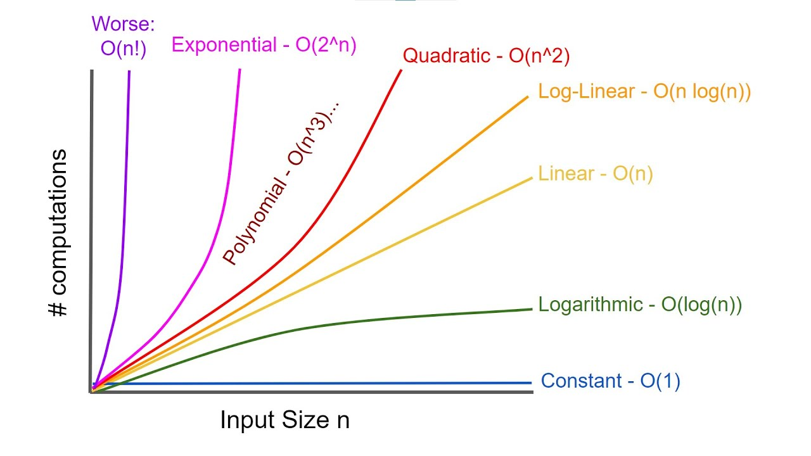

# 자료 구조

- 자료 구조: 효율적으로 데이터를 관리하고 수정, 삭제, 탐색, 저장할 수 있는 데이터 집합
- C++은 STL을 기반으로 전반적인 자료 구조를 가장 잘 설명할 수 있는 언어이며, 이를 기반으로 자료 구조에 대한 참조 코드를 제공한다.
  - STL: C++의 표준 템플릿 라이브러리이자 스택, 배열 등 데이터 구조의 함수 등을 제공하는 라이브러리의 묶음

## 복잡도

- 복잡도는 시간 복잡도와 공간 복잡도로 나뉜다

### 시간 복잡도

- 시간 복잡도: 무넺를 해결하는 데 걸리는 시간과 입력의 함수 관계. 어떠한 알고리즘의 로직이 얼마나 오랜 시간이 걸리는지를 나타내는 데 사용

- C++의 기본

  - ```c++
    #include <bits/stdc++.h> //1.
    using namespace std;  //2.
    string a; //3.
    int main()
    {
    	cin >> a; //4.
    	cout << a << "\n"; //5.
    	return 0; //6.
    }
    
    ```

    1. 헤더 파일. STL 라이브러리를 import. bits/stdc++.h는 모든 표준 라이브러리가 포함된 헤더
    2. std라는 네임스페이스를 사용한다는 뜻. cin이나 cout를 사용할 때는 std::cin과 같이 네임스페이스를 달아서 호출해야 하는데, 이를 기본으로 설정한다는 뜻.
       - 네임스페이스: 같은 클래스 이름 구별, 모듈화에 쓰이는 이름
    3. 문자열 선언. <타입> <변수명>으로 선언. string a = 'apple'과 같이 쓴다면, a를 lvalue라고 하고 apple을 rvalue라고 한다. lvalue는 나중에 다시 사용될 수 있는 변수이고, rvalue는 한 번 쓰고 다시 사용되지 않는 변수를 말한다.
    4. 입력으로는 cin,scanf가 있다
    5. 출력으로는 cout와 printf가 있다
    6. return 0이다. 프로세스가 정상적으로 마무리됨을 뜻한다.

- 빅오 표기법

  - 입력 범위 n을 기준으로 로직이 몇 번 반복되는지 나타내는 것

  - ex) 10n<sup>2</sup> + n의 시간복잡도를 가지는 코드 => O(n<sup>2</sup>)

  - ```c++
    #include <bits/stdc++.h>
    using namespace std;
    int n;
    int square = 0;
    int one = 0;
    int main()
    {
    	cin >> n;
    	for (int i=0; i < 10; i++) {
    		for (int j=0; j < n; j++) {
    			for (int k=0; k < n; k++) {
    				if (true) square++;
    			}
    		}
    	}
    	for (int i=0; i < n; i++) {
    		if (true) one++;
    	}
    	cout << (square/10) << '\n';
    	cout << one;
    }
    
    ```

  - 가장 여향을 많이 끼치는 항의 상수 인자를 빼고 나머지 항을 없앤다.

- 시간 복잡도의 존재 이유

  - 효율적인 코드로 개선하는 데 쓰이는 척도
  - 

### 공간 복잡도

- 프로그램을 실행시켰을 때 필요로 하는 자원 공간의 양

- 정적 변수로 선언된 것과 동적으로 재귀적인 함수로 인해 공간을 계속해서 필요로 할 경우도 포함

- ```c++
  int a[1004]; // a 배열은 1004*4바이트 크기를 가지게 된다
  ```

### 자료 구조에서의 시간 복잡도

- 자료 구조의 평균 시간 복잡도

- | 자료 구조                            | 접근    | 탐색    | 삽입    | 삭제    |
  | ------------------------------------ | ------- | ------- | ------- | ------- |
  | 배열(array)                          | O(1)    | O(n)    | O(n)    | O(n)    |
  | 스택(stack)                          | O(n)    | O(n)    | O(1)    | O(1)    |
  | 큐(queue)                            | O(n)    | O(n)    | O(1)    | O(1)    |
  | 이중 연결 리스트(doubly linked list) | O(n)    | O(n)    | O(1)    | O(1)    |
  | 해시 테이블(hash table)              | O(1)    | O(1)    | O(1)    | O(1)    |
  | 이진 탐색 트리(BST)                  | O(logn) | O(logn) | O(logn) | O(logn) |
  | AVL 트리                             | O(logn) | O(logn) | O(logn) | O(logn) |
  | 레드 블랙 트리                       | O(logn) | O(logn) | O(logn) | O(logn) |

- 자료 구조 최악의 시간 복잡도

- | 자료 구조                            | 접근    | 탐색    | 삽입    | 삭제    |
  | ------------------------------------ | ------- | ------- | ------- | ------- |
  | 배열(array)                          | O(1)    | O(n)    | O(n)    | O(n)    |
  | 스택(stack)                          | O(n)    | O(n)    | O(1)    | O(1)    |
  | 큐(queue)                            | O(n)    | O(n)    | O(1)    | O(1)    |
  | 이중 연결 리스트(doubly linked list) | O(n)    | O(n)    | O(1)    | O(1)    |
  | **해시 테이블(hash table)**          | O(n)    | O(n)    | O(n)    | O(n)    |
  | **이진 탐색 트리(BST)**              | O(n)    | O(n)    | O(n)    | O(n)    |
  | AVL 트리                             | O(logn) | O(logn) | O(logn) | O(logn) |
  | 레드 블랙 트리                       | O(logn) | O(logn) | O(logn) | O(logn) |

## 선형 자료 구조

- 선형 자료 구조: 요소가 일렬로 나열되어 있는 자료 구조

### 연결 리스트

- 

- 데이터를 감싼 노드를 포인터로 연결해서 공간적인 효율성을 극대화시킨 자료 구조

- prev 포인터와 next 포인터로 앞과 뒤의 노드를 연결시킨 것

- 가장 앞에 있는 노드를 head라고 한다.

- 삽입과 삭제가 O(1)이 걸리고 탐색에는 O(n)이 걸린다.

- 싱글 연결 리스트: next 포인터만 가진다.

- 이중 연결 리스트: next포인터와 prev 포인터를 가진다

- 원형 이중 연결 리스트: 이중 연결 리스트와 같지만 마지막 노드의 next 포인터가 헤드 노드를 가리킨다.

- 이중 연결 리스트 사용

- ```c++
  #include <bits/stdc++.h>
  // dev c++에서 사용시 auto가 작동하지 않을 수 있는데, 해결은 https://www.geeksforgeeks.org/how-to-fix-auto-keyword-error-in-dev-cpp/#:~:text=The%20auto%20keyword%20in%20C,return%20type%20expression%20at%20runtime.를 참조하면 된다.
  using namespace std;
  int main() {
  	list<int> a;
  	for (int i = 0; i < 10; i++)a.push_back(i);
  	for (int i = 0; i < 10; i++)a.push_front(i);
  	auto it = a.begin(); it++;
  	a.insert(it, 1000);
  	for (auto it : a) cout << it << " ";
  	cout << '\n';
  	a.pop_front();
  	a.pop_back();
  	for (auto it : a) cout << it << " ";
  	cout << '\n';
  	return 0;
  }
  ```

### 배열

- 같은 타입의 변수들로 이루어져 있고, 크기가 정해져 있으며, 인접한 메모리 위치에 있는 데이터를 모아놓은 집합
- 중복을 허용하고 순서가 있다
- 탐색에 O(1)이 되어 랜덤 접근이 가능하다. 삽입과 삭제에는 O(n)이 걸린다
- 인덱스에 해당하는 원소를 빠르게 접근해야 하거나 간단하게 데이터를 쌓고 싶을 때 사용한다.
- 데이터 추가와 삭제를 많이 하는 것은 연결 리스트, 탐색을 많이 하는 것은 배열로 하는 것이 좋다.

- 랜덤 접근과 순차적 접근
  - 
  - 랜덤 접근: 동일한 시간에 배열과 같은 순차적인 데이터가 있을 때 임의의 인덱스에 해당하는 데이터에 접근할 수 있는 기능
  - 순차적 접근: 데이터를 저장된 순서대로 검색한다.
- 배열과 연결 리스트 비교
  - 배열은 상자를 순서대로 나열한 데이터 구조이며 몇 번째 상자인지만 알면 해당 상자의 요소를 끄집어 낼 수 있다.
  - 연결 리스트는 상자를 선으로 연결한 형태의 데이터 구조이며, 상자 안의 요소를 알기 위해서는 하나씩 상자 내부를 확인해야 한다.
  - 탐색은 배열이 빠르고 연결 리스트는 느리다
  - 데이터 추가 및 삭제는 연결 리스트가 더 빠르고 배열이 느리다(배열은 모든 상자를 앞으로 옮겨야 추가가 가능하지만, 연결 리스트는 선을 바꿔서 연결하기만 하면 되기 떄문)

### 벡터

- 동적으로 요소를 할당할 수 있는 동적 배열

- 컴파일 시점에 개수를 모른다면 벡터를 사용해야 한다.

- 종복을 허용하고 순서가 있으며 랜덤 접근이 가능하다

- 탐색과 맨 뒤의 요소를 삭제하거나 삽입하는 데 O(1)이 걸리며, 맨 뒤나 맨 앞이 아닌 요소를 삭제하고 삽입하는 데 O(n)의 시간이 걸린다

- 뒤에서부터 삽입하는 push_back()의 경우 O(1)이 걸리는데, 벡터의 크기가 증가되는 시간 복잡도가 amortized 복잡도와 유사한 복잡도를 가지기 때문이다.

  - | 함수         | 용량 | 비용  |
    | ------------ | ---- | ----- |
    | push_back(1) | 1    | 1     |
    | push_back(2) | 2    | 1 + 1 |
    | push_back(3) | 4    | 2 + 1 |
    | push_back(4) | 4    | 1     |
    | push_back(5) | 8    | 4 + 1 |
    | push_back(6) | 8    | 1     |
    | push_back(7) | 8    | 1     |
    | push_back(8) | 8    | 1     |
    | push_back(9) | 16   | 8 + 1 |

  - $$
    T(n)=\sum_{i=0}^{n}{c_i}\leq n+\sum_{i=0}^{logn}{2^i} = n+2n-1 = 3n-1
    $$

  - 평균적으로 드는 비용 = T(n)/n = 3 - 1/n이다. 따라서 1이라는 상수 시간보다는 크지만 상수 시간에 가까운 amortized 복잡도를 가진다.

### 스택

- 가장 마지막으로 들어간 데이터가 가장 첫 번째로 나오는 성질(LIFO, Last In First Out)을 가진 자료구조
- 재귀적인 함수, 알고리즘에 사용, 웹 브라우저 방문 기록 등에 사용한다
- 삽입 및 삭제에 O(1), 탐색에 O(n)이 걸린다

### 큐

- 먼저 집어넣은 데이터가 먼저 나오는 성질(FIFO, First In First Out)을 지닌 자료 구조
- 삽입 및 삭제에 O(1), 탐색에 O(n)이 걸린다.
- CPU 작업을 기다리는 프로세스, 스레드 행렬 또는 네트워크 접속을 기다리는 행렬, 너비 우선 탐색, 캐시 등에 사용된다.

## 비선형 자료 구조

- 일렬로 나열하지 않고 자료 순서나 관계가 복잡한 구조
- 일반적으로 트리나 그래프를 말한다.

### 그래프

- 그래프는 정점과 간선으로 이루어진 자료 구조를 말한다
- 정점과 간선
  - 정점(vertex): 어떠한 곳
  - 간선(edge): 두 정점을 잇는 선
  - 단방향 간선, 양방향 간선
  - outdegree: 정점으로 나가는 간선
  - indegree: 들어오는 간선
  - 가중치: 간선과 정점 사이에 드는 비용

### 트리

- 그래프 중 하나로 그래프의 특징처럼 정점과 간선으로 이루어져 있고, 트리 구조로 배열된 일종의 계층적 데이터의 집합
- 루프 노드, 내부 노드, 리프 노드 등으로 구성된다
- 트리로 이루어진 집합을 숲이라고 한다.
- 트리의 특징
  - 부모, 자식 계층 구조를 가진다.
  - V-1 = E라는 특징이 있다. 간선의 수는 노드 수 -1이다.
  - 임의의 두 노드 사이의 경로는 유일무이하게 존재한다. 트리 내의 어떤 노드와 어떤 노드의 경로는 반드시 있다.
- 트리의 구성
  - 트리는 루트 노드, 내부 노드, 리프 노드로 이루어져 있다.
- 루트 노드
  - 가장 위에 있는 노드
- 내부 노드
  - 루트 노드와 내부 노드 사이에 있는 노드
- 리프 노드
  - 자식 노드가 없는 노드
- 트리의 높이와 레벨
  - 깊이: 루트 노드부터 특정 노드까지 최단 거리로 갔을 때의 거리
  - 높이: 루트 노드부터 리프 노드까지 거지 중 가장 ㅣㄴ 거리
  - 레벨: 보통 깊이와 같은 의미
  - 서브트리: 트리 내의 하위 집합. 트리 내에 있는 부분집합
- 이진 트리
  - 자식의 노드 수가 두 개 이하인 트리
  - 정이진 트리(full binary tree): 자식 노드가 0 또는 두 개인 이진 트리
  - 완전 이진 트리(complete binary tree): 왼쪽에서부터 채워져 있는 이진 트리. 마지막 레벨을 제외하고는 모든 레벨이 완전히 채워져 있으며, 마지막 레벨의 경우 왼쪽부터 채워져 있다.
  - 변질 이진 트리(degenerate binary tree): 자식 노드가 하나밖에 없는 이진 트리
  - 포화 이진 트리(perfect binary tree): 모든 노드가 꽉 차 있는 이진 트리
  - 균형 이진 트리(balanced binary tree): 왼쪽과 오른쪽 노드의 높이 차이가 1 이하인 이진 트리. map, set을 구성하는 레드 블랙 트리는 균형 이진 트리 중 하나이다.
- 이진 탐색 트리(BST)
  - 노드의 오른쪽 하위 트리에는 노드 값보다 큰 값이 있는 노드만 포함되고, 왼쪽 하위 트리에는 노드 값보다 작은 값이 들어 있는 트리
  - 왼쪽 및 오른쪽 하위 트리도 동일한 특성을 가진다.
  - 보통 요소를 찾을 때 O(logn)이 걸린다. 하지만 최악의 경우 O(n)이 걸린다(삽입 순서에 따라 선형적인 경우).
- AVL(Adelson-Velsky and Landis) 트리
  - 최악의 경우 선형적인 트리가 되는 것을 방지하고 스스로 균형을 잡는 이진 탐색 트리
  - 두 자식 서브트리의 높이는 항상 최대 1만큼 차이가 난다.
  - 탐색, 삽입, 삭제 모두 시간 복잡도가 O(logn)이며 삽입, 삭제를 할 때마다 균형이 안 맞는 것을 맞추기 위해 일부를 왼쪽 혹은 오른쪽으로 회전시키며 균형을 잡는다.

- 레드 블랙 트리
  - 균형 이진 탐색 트리로 탐색, 삽입, 삭제 모두 시간 복잡도가 O(logn)이다.
  - 각 노드는 빨간색 또는 검은색의 색상을 나타내는 추가 비트를 저장하며, 삽입 및 삭제 중에 트리가 균형을 유지하는 데 사용된다. C++ STL의 set, multiset, map, multimap이 레드 블랙 트리를 이용하여 구현되어 있다.
  - 모든 리프 노드와 루트 노드는 블랙이고 어떤 노드가 레드이면 그 노드의 자식은 반드시 블랙이다.등의 규칙을 기반으로 균형을 잡는 트리이다.

### 힙

- 완전 이진 트리 기반의 자료 구조이며, 최소힙과 최대힙 두 가지가 있고 해당 힙에 따라 특정한 특징을 지킨 트리를 말한다.
- 최대힙: 루트 노드에 있는 키는 모든 자식에 있는 키 중에서 가장 커야 한다. 또한, 각 노드의 자식 노드와의 관계도 이와 같은 특징이 재귀적으로 이루어져야 한다.
- 최소힙: 최소힙에서 루트 노드에 있는 키는 모든 자식에 있는 키 중에서 최솟값이어야 한다. 또한, 각 노드의 자식 노드와의 관계도 이와 같은 특징이 재귀적으로 이루어져야 한다.
- 최대힙의 삽입
  1. 새로운 요소가 들어오면 새로운 노드를 힙의 마지막 노드에 이어서 삽입
  2. 새로운 노드를 부모 노드들과의 크기를 비교하며 교환하여 힙의 성질을 만족
- 최대힙의 삭제
  - 최댓값은 루트 노드이므로 루트 노드가 삭제되고, 그 이후 마지막 노드와 루트 노드를 스왑하는 등의 ㄱ과정을 거쳐 재구성한다.

### 우선순위 큐

- 우선순위 대기열이라고도 하며, 대기열에서 우선순위가 높은 요소가 우선순위가 낮은 요소보다 먼저 제공되는 자료 구조
- 힙을 기반으로 구현

### 맵

- 특정 순서에 따라 키와 매핑된 값의 조합으로 형성된 자료 구조
- ex) "apple":1, "banana":2
- 레드 블랙 트리 자료 구조를 기반으로 형성. 삽입하면 자동으로 정렬
- map<string, int> 형태로 구현
- 배열과 비슷하게 clear() 함수로 맵에 있는 모든 요소를 삭제할 수 있으며, size()로 amp 크기를 구할 수 있다.
- erase()로 해당 키와 키에 매핑된 값을 지울 수 있다.
- map은 해시 테이블을 구현하는 데 사용한다.
- 정렬을 보장하지 않는 unordered_map과 정렬을 보장하는 map이 있다.

### 셋

- 특정 순서에 따라 고유한 요소를 저장하는 컨테이너
- 중복되는 요소는 없고 오로지 희소한 값만 저장하는 자료 구조

### 해시 테이블

- 무한에 가까운 데이터들을 유한한 개수의 해시 값으로 매핑한 테이블
- 삽입, 삭제, 탐색 시 평균적으로 O(1)의 시간 복잡도를 가지며 unordered_map으로 구현한다.