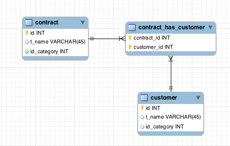

# 데이터베이스

## 데이터베이스의 기본

- 데이터베이스(DB, DataBase): 일정한 규칙, 혹은 규약을 통해 구조화되어 저장되는 데이터의 모음
- DBMS(DataBase Management System): 데이터베이스를 제어, 관리하는 통합 시스템
- 실시간 접근과 동시 굥유 가능

### 엔티티

- 사람,장소, 물건, 사건, 개념 등 여러 개의 속성을 지닌 명사
- 약한 엔티티와 강한 엔티티
  - A가 B에 종속된 형태라면, A는 약한 엔티티 B는 강한 엔티티이다.

### 릴레이션

- 데이터베이스에서 정보를 구분하여 저장하는 기본 단위
- 엔티티가 데이터베이스에서 관리될 때는 릴레이션으로 변화된다.
- 관계형 데이터베이스에서는 '테이블', NoSQL 데이터베이스에서는 '컬렉션'이라고 한다.

- 테이블과 컬렉션
  - 데이터 베이스의 종류는 크게 관계형과 NoSQL 데이터베이스로 나눌 수 있다.
  - 관계형 데이터베이스
    - ex) MySQL
    - 구조: 레코드-테이블-데이터베이스
  - NoSQL 데이터베이스
    - ex) MongoDB
    - 구조: 도큐먼트-컬렉션-데이터베이스

### 속성

- 릴레이션에서 관리하는 구체적이며 고유한 이름을 갖는 정보

### 도메인

- 릴레이션에 포함된 각각의 속성들이 가질 수 있는 값의 집합

### 필드와 레코드

- 필드: 속성 혹은 속석명

- 레코드: 테이블에 쌓이는 행 단위의 테이터. 튜플이라고도 한다.

- ```sql
  CREATE TABLE book(
  	id INT NOT NULL AUTO_INCREMENT,
      title VARCHAR(255),
      author_id INT,
      publishing_year VARCHAR(255),
      genre VARCHAR(255),
      create_at DATETIME,
      updated_at DATETIME,
      PRIMARY KEY (id)
  );
  ```

- 필드 타입

  - 숫자 타입

    - | 타입      | 용량(바이트) | 최솟값(부호 있음) | 최솟값(부호 없음) | 최댓값(부호 있음) | 최댓값(부호 없음) |
      | --------- | ------------ | ----------------- | ----------------- | ----------------- | ----------------- |
      | TINYINT   | 1            | -128              | 0                 | 127               | 255               |
      | SMALLINT  | 2            | -32768            | 0                 | 32767             | 65535             |
      | MEDIUMINT | 3            | -8388608          | 0                 | 8388607           | 16777215          |
      | INT       | 4            | -2147483648       | 0                 | 2147483647        | 4294967295        |
      | BIGINT    | 8            | -263              | 0                 | 263-1             | 264-1             |

  - 날짜 타입

    - DATE
      - 날짜 부분은 있지만 시간 부분은 없는 값에 사용
      - 1000-01-01~9999-12-31의 범위
      - 3바이트의 용량
    - DATETIME
      - 날짜 및 시간 부분을 모두 포함하는 값에 사용
      - 1970-01-01 00:00:01 ~ 2038-01-19 03:14:07의 범위
      - 4바이트의 용량
    - TIMESTAMP
      - 날짜 및 시간 부분을 모두 포함하는 값에 사용
      - 1970-01-01 00:00:01 ~ 2038-01-19 03:14:07의 범위
      - 4바이트의 용량

  - 문자 타입

    - CHAR와 VARCHAR
      - 안에 수를 입력해서 몇 자까지 입력할지 정한다.
      - CHAR
        - 테이블을 생성할 때 선언한 길이로 고정
        - 길이는 0~255의 값을 가진다
        - 레코드를 저장할 때 무조건 선언한 길이 값으로 고정해서 저장
      - VARCHAR
        - 가변 길이 문자열
        - 길이는 0~65535의 값
        - 입력된 데이터에 따라 용량을 가변해서 저장
      - CHAR의 경우 검색에 유리, 검색을 별로 하지 않고 유동적인 길이를 가진 데이터는 VARCHAR이 유리
    - TEXT와 BLOB
      - 큰 데이터를 저장할 때 쓰는 타입
      - TEXT
        - 큰 문자열 저장에 쓰며 주로 게시판의 본문을 저장할 때 사용
      - BLOB
        - 이미지, 동영상 등 큰 데이터 저장에 사용
        - 보통은 아마존의 이미지 호스팅 서비스인 S3를 이용하는 등 서버에 파일을 올리고 VARCHAR로 파일의 경로를 저장한다.
    - ENUM과 SET
      - ENUM과 SET 모두 문자열을 열거한 타입이다.
      - ENUM
        - ENUM('x-small', 'small', 'medium', 'large', 'x-large') 형태로 쓰이며, 이중에서 하나만 선택하는 단일 선택만 가능하고 ENUM 리스트에 없는 잘못된 값을 삽입하면 빈 문자열이 대신 삽입된다.
        - ENUM을 이용하면 x-small 등이 0,1 등으로 매핑되어 메모리를 적게 사용하는 이점을 얻는다.
        - 최대 65535개의 요소들을 넣을 수 있다.
      - SET
        - ENUM과 비슷하지만 여러 개의 데이터를 선택할 수 있고 비트 단위의 연산을 할 수 있으며 최대 64개의 요소를 집어넣을 수 있다는 점이 다르다.
      - ENUM이나 SET을 쓸 경우 공간적으로 이점
      - 애플리케이션의 수정에 따라 데이터베이스의 ENUM이나 SET에서 정의한 목록을 수정해야 한다는 단점이 있다.

### 관계

- 테이블은 서로 관계가 정의되어 있으며, 이러한 관계를 관계화살표로 나타낸다.

- 1:1 관계
  - 
- 1:N 관계
  - 
- N:M 관계
  - 

### 키

- 
- 슈퍼키는 유일성을 갖춘 키
- 후보키는 유일성 + 최소성을 갖춘 키
- 후보키 중에 기본키로 선택되지 못한 키는 대체키가 된다.
- 유일성: 중복되는 값이 없음
- 최소성: 필드를 조합하지 않고 최소 필드만 써서 키를 형성할 수 있는 것
- 기본키(Primary Key, PK)
  - 유일성과 최소성을 만족하는 키
  - 테이블의 데이터 중 고유하게 존재하는 속성, 중복되어서는 안 된다.
  - 자연키 또는 인조키 중에 골라 설정한다.
  - 자연키
    - 중복된 값들을 제외해 나가면 중복되지 앟는 것을 자연스레 뽑다가 나오는 키
    - 언젠가는 변하는 속성을 가진다
  - 인조키
    - 인위적으로 생성한 키
    - 오라클은 sequence, MySQL은 auto increment 등으로 설정
    - 변하지 않는다
- 외래키(Foreign Key, FK)
  - 다른 기본키를 그대로 참조하는 값
  - 개체와의 관계를 식별하는 데 사용
  - 중복되어도 괜찮다.
- 후보키(candidate key)
  - 기본키가 될 수 있는 후보들
  - 유일성과 최소성을 동시에 만족하는 키
- 대체키(alternate key)
  - 후보키가 두 개 이상일 경우 어느 하나를 기본키로 지정하고 남은 후보키들
- 슈퍼키
  - 각 레코드를 유일하게 식별할 수 있는 유일성을 갖춘 키

## ERD와 정규화 과정

- ERD(Entity Relationship Diagram)
  - 데이터베이스를 구축할 때 가장 기초적인 뼈대 역할, 릴레이션 간의 관계를 정의한 것

### ERD의 중요성

- 시스템의 요구사항을 기본으로 작성
- ERD를 기본으로 데이터베이스를 구축
- 데이터베이스 구축 이후 디버깅 또는 비즈니스 프로세스 재설계가 필요할 경우 설계도 역할
- 관계형 구조로 표현할 수 있는 데이터를 구성하는 데 유용
- 비정형 데이터를 충분히 표현할 수 없다는 단점
- 비정형 데이터: 비구조화 데이터. 미리 정의된 데이터 모델이 없거나 미리 정의된 방식으로 정리되지 않은 정보

### 정규화 과정

- 릴레이션 간의 잘못된 종속 관계로 인해 데이터베이스 이상현상이 일어나서 이를 해결하거나, 저장 공간을 효율적으로 사용하기 위해 릴레이션을 여러 개로 분리하는 과정
- 데이터베이스 이상(anomaly) 현상
  - 테이블에서 일부 속성들의 종속으로 인해 데이터의 중복이 발생하고, 이 중복(redundancy)으로 인해 테이블 조작 시 문제가 발생하는 현상
  - 삽입 이상: 테이블에 데이터를 삽입할 때 의도와는 상관없이 원하지 않은 값들로 인해 삽입할 수 없게 되는 현상
  - 삭제 이상: 테이블에서 한 튜플을 삭제할 때 의도와는 상관없는 값들도 함께 삭제되는, 연쇄 삭제가 일어나는 현상
  - 갱신 이상: 테이블에서 튜플에 있는 속성 값을 갱신할 때 일부 튜플의 정보만 갱신되어 정보에 불일치성(inconsistency)이 생기는 현상
- 정규화 과정은 정규형 원칙을 기반으로 정규형을 만들어나가는 과정
- 정규화된 정도는 정규형(NF, Normal Form)으로 표현한다.
- 정규형의 원칙
  - 좀 더 좋은 구조
  - 자료의 중복성은 감소하게
  - 독립적인 관계는 별도의 릴레이션으로
  - 각각의 릴레이션은 독립적인 표현이 가능하게
- 제1정규형
  - 릴레이션의 모든 도메인이 더 이상 분해될 수 없는 원자 값(atomic value)만으로 구성되어야 한다.
  - 릴레이션의 속성 값 중에서 한 개의 기본키에 대해 두 개 이상의 값을 가지는 반복 집합이 있어서는 안 된다.
- 제2정규형
  - 릴레이션이 제1정규형이며 부분 함수의 종속성을 제거한 형태
  - 부분 함수의 종속성 제거: 기본키가 아닌 모든 속성이 기본키에 완전 함수 종속인 것
  - 릴레이션 분해 시 동등한 릴레이션으로 분해하고, 정보 손실이 발생하지 않는 무손실 분해로 분해되어야 한다.
- 제3정규형
  - 기본키가 아닌 모든 속성이 이행적 함수 종속(transitive FD)을 만족하지 않는 상태
  - 이행적 함수 종속: A => B, B => C가 존재하면 A => C가 성립하는데, 이 때 집합 C가 집합 A에 이행적으로 함수 종속이 되었다고 한다.
- 보이스/코드 정규형(BCNF)
  - 제3정규형이고, 결정자가 후보키가 아닌 함수 종속 관계를 제거하여 릴레이션의 함수 종속 관계에서 모든 결정자가 후보키인 상태
  - 결정자: 함수 종속 관계에서 특정 종속자를 결정짓는 요소, X=>Y일 때 X는 결정자, Y는 종속자이다.

## 트랜잭션과 무결성

### 트랜잭션

- 데이터베이스에서 하나의 논리적 기능을 수행하기 위한 작업의 단위

- 여러 개의 쿼리들을 하나로 묶는 단위

- 특징: 원자성, 일관성, 독립성, 지속성 (ACID)

- 원자성(Atomicity)

  - 트랜잭션과 관련된 일이 모두 수행되었거나 되지 않았거나를 보장하는 특징
  - 트랜잭션 단위로 로직들을 묶을 때 외부 API를 호출하는 것이 있으면 안 된다. 만약 있다면 롤백이 일어났을 때 어떻게 해야 할 것인지에 대한 해결 방법이 있어야하고 트랜잭션 전파를 신경써서 관리해야 한다.
  - 커밋과 롤백
    - 커밋
      - 여러 쿼리가 성공적으로 처리되었다고 확정하는 명령어
      - 트랜잭션 단위로 수행되며 변경된 내용이 모두 영구적으로 저장되는 것
    - 롤백
      - 트랜잭션으로 처리한 하나의 묶음 과정을 일어나기 전으로 돌리는 일
  - 트랜잭션 전파
    - 여러 트랜잭션 관련 메서드의 호출을 하나의 트랜잭션에 묶이도록 하는 것

- 일관성(Consistency)

  - 허용된 방식으로만 데이터를 변경해야 하는 것

- 격리성(Isolation)

  - 트랜잭션 수행 시 서로 끼어들지 못하는 것

  - 복수의 병렬 트랜잭션은 서로 격리되어 마치 순차적으로 실행되는 것처럼 작동되어야 하고, 데이터베이스는 여러 사용자가 같은 데이터에 접근할 수 있어야 한다.

  - | Isolation level  | Dirty Read | Lost Update | Non repeatable Reads | Phantom Reads |
    | ---------------- | ---------- | ----------- | -------------------- | ------------- |
    | Read Uncommitted | Y          | Y           | Y                    | Y             |
    | Read Committed   | N          | Y           | Y                    | Y             |
    | Repeatable Read  | N          | N           | N                    | Y             |
    | Snapshot         | N          | N           | N                    | N             |
    | Serializable     | N          | N           | N                    | N             |

  - 위로 올라갈수록 동시성이 강해지지만 격리성은 약해지고, 내려갈수록 동시성은 약해지지만 격리성은 강해진다

  - 팬텀 리드(phantom read)

    - 한 트랜잭션 내에서 동일한 쿼리를 보냈을 때 해당 조회 결과가 다른 경우

  - 반복 가능하지 않은 조회(non repeatable read)

    - 한 트랜잭션 내의 같은 행에 두 번 이상 조회가 발생했는데, 그 값이 다른 경우
    - 팬텀 리드와 다른 점은 반복 가능하지 않은 조회는 행 값이 달라질 수도 있는데, 팬텀 리드는 다른 행이 선택될 수도 있다는 것을 의미

  - 더티 리드(dirty read)

    - 한 트랜잭션이 실행 중일 때 다른 트랜잭션에 의해 수정되었지만 아직 '커밋되지 않은' 행의 데이터를 읽을 수 있을 때 발생

  - 격리수준

    - Serializable
      - 트랜잭션을 순차적으로 진행
      - 여러 트랜잭션이 동시에 같은 행에 접근할 수 없다
      - 매우 엄격한 수준으로 해당 행에 대해 격리. 이후 트랜잭션이 이 행에 대해 일어나면 기다려야 한다
      - 교착 상태가 일어날 확률도 높고 가장 성능이 떨어지는 격리 수준
    - Repeatable Read
      - 하나의 트랜잭션이 수정한 행을 다른 트랜잭션이 수정할 수 없도록 막아주지만 새로운 행을 추가하는 것은 막지 않는다
      - 이후에 추가된 행이 발견될 수도 있다
    - Read Committed
      - 가장 많이 사용되는 격리 수준
      - MySQL 8.0, PostgreSQL, SQL Server, 오라클에서 기본값으로 설정되어 있다
      - Read uncommitted와 달리 다른 트랜잭션이 커밋하지 않은 정보는 읽을 수 없다(커밋 완료된 데이터에 대해서만 조회가 가능)
      - 어떤 트랜잭션이 접근한 행을 다른 트랜잭션이 수정할 수 있다
    - Read Uncommitted
      - 가장 낮은 격리 수준으로 하나의 트랜잭션이 커밋되기 이전에 다른 트랜잭션에 노출되는 문제가 있지만 가장 빠르다
      - 데이터 무결성을 위해 되도록이면 사용하지 않는 것이 이상적이나 몇몇 행이 제대로 조회되지 않더라도 괜찮은 거대한 양의 데이터를 어림잡아 집계하는 데는 사용하면 괜찮다.

- 지속성(Durability)

  - 성공적으로 수행된 트랜잭션은 영원히 반영되어야 한다.
  - 데이터베이스에 시스템 장애가 발생해도 원래 상태로 복구하는 회복 기능이 있어야 한다
  - 데이터베이스는 이를 위해 체크섬, 저널링, 롤백 등의 기능을 제공한다
  - 체크섬: 중복 검사의 한 형태로, 오류 정정을 통해 송신된 자료의 무결성을 보호하는 단순한 방법
  - 저널링: 파일 시스템 또는 데이터베이스 시스템에 변경 사항을 반영하기 전에 로깅하는 것, 트랜잭션 등 변경 사항에 대한 로그를 남기는 것

### 무결성

- 데이터의 정확성, 일관성, 유효성을 유지하는 것
- 무결성의 종류
  - 개체 무결성: 기본키로 선택된 필드는 빈 값을 허용하지 않는다
  - 참조 무결성: 서로 참조 관계에 있는 두 테이블의 데이터는 항상 일관된 값을 유지해야 한다
  - 고유 무결성: 특정 속성에 대해 고유한 값을 가지도록 조건이 주어진 경우 그 속성 값은 모두 고유한 값을 가진다
  - NULL 무결성: 특정 속성 값에 NULL이 올 수 없다는 조건이 주어진 경우 그 속성 값은 NULL이 될 수 없다는 제약 조건

## 데이터베이스의 종류

### 관계형 데이터베이스(RDBMS)

- 행과 열을 가지는 표 형식 데이터를 저장하는 형태의 데이터베이스
- SQL이라는 언어를 사용하여 조작
- ex) MySQL, PostgreSQL, 오라클, SQL Server...
- MySQL
  - C, C++로 제작
  - MyISAM 인덱스 압축 기술
  - B-트리 기반의 인덱스
  - 스레드 기반의 메모리 할당 시스템
  - 매우 빠른 조인
  - 최대 64개의 인덱스 제공
  - 대용량 데이터베이스를 위해 설계
  - 롤백, 커밋, 이중 암호 지원 보안 등의 기능 제공
  - 쿼리 캐시를 지원하여 입력된 쿼리 문에 대한 전체 결과 집합을 저장하기 때문에 사용자가 작성한 쿼리가 캐시에 있는 쿼리와 동일하면 서버는 단순히 구문 분석, 최적화 및 실행을 건너뛰고 캐시의 출력만 표시
  - Mysql storage architecture
  - 
  - 스토리지 엔진
    - 모듈식 아키텍처로 쉽게 스토리지 엔진 바꿀 수 있음
    - 데이터 웨어하우징, 트랜잭션 처리, 고가용성 처리에 강점
    - 스토리지 엔진 위에는 커넥터 API 및 서비스 계층을 통해 MySQL 데이터베이스와 쉽게 상호 작용 가능
- PostgreSQL
  - VACCUM: 디스크 조각이 차지하는 영역을 회수할 수 있는 장치
  - 최대 테이블의 크기는 32TB
  - SQL 뿐만 아니라 JSON을 이용해서 데이터에 접근 가능
  - 지정 시간에 복구하는 기능, 로깅, 접근 제어, 중첩된 트랜잭션, 백업 등을 할 수 있다

### NoSQL 데이터베이스

- NoSQL(Not only SQL)
- SQL을 사용하지 않는 데이터베이스
- MongoDB
  - JSON을 통해 데이터에 접근 가능
  - Binary JSON 형태(BSON)로 데이터 저장
  - 와이어드타이거 엔진이 기본 스토리지 엔진으로 장착된 키-값 데이터 모델에서 확장된 도큐먼트 기반의 데이터베이스
  - 확장성이 뛰어나고 빅데이터를 저장할 때 성능이 좋고 고가용성, 샤딩, 레플리카셋을 지원
  - 스키마를 정해놓지 않고 데이터를 삽입할 수 있기 때문에 다양한 도메인의 데이터베이스를 기반으로 분석하거나 로깅 등을 구현할 때 강점
  - 도큐먼트를 생성할 때마다 다른 컬렉션에서 중복된 값을 지니기 힘든 유니크한 값인 ObjectID가 생성
    - 기본키로 유닉스 시간 기반의 타입스탬프(4바이트), 랜덤 값(5바이트), 카운터(3바이트)로 이루어져 있음
- redis
  - 인메모리 데이터베이스이자 키-값 데이터 모델 기반의 데이터베이스
  - 기본적인 데이터 타입은 문자열
  - 최대 512MB까지 저장 가능
  - 셋, 해시 지원
  - pub/sub 기능을 통해 채팅 시스템, 다른 데이터베이스 앞단에 두어 사용하는 캐싱 계층, 단순한 키-값이 필요한 세션 정보 관리, 정렬된 셋 자료 구조를 이요한 실시간 순위표 서비스에 사용

## 인덱스

### 인덱스의 필요성

- 인덱스는 데이터를 빠르게 찾을 수 있는 하나의 장치이다

### B-트리

- 루프 노드, 리프 노드, 루프 노드와 리프 노드 사이에 있는 브랜치 노드로 나뉜다.
- 트리 탐색은 맨 위 루프 노드부터 탐색이 일어나며 브랜치 노드를 거쳐 리프 노드까지 내려온다.
- 인덱스가 효율적인 이유와 대수확장성
  - 인덱스가 효율적인 이유: 효율적인 단계를 거쳐 모든 요소에 접근할 수 있는 균형 잡힌 트리 구조와 트리 깊이의 대수확장성 때문
  - 대수확장성
    - 트리 깊이가 리프 노드 수에 비해 매우 느리게 성장하는 것 의미
    - 기본적으로 인덱스가 한 깊이씩 증가할 때마다 최대 인덱스 항목의 수는 4배씩 증가

### 인덱스 만드는 방법

- MySQL
  - 클러스터형 인덱스와 세컨더리 인덱스가 있다
  - 클러스터형 인덱스
    - 테이블당 하나씩 설정 가능
    - primary key 옵션으로 기본키를 만들면 클러스터형 인덱스 생성 가능
    - unique not null 옵션을 붙이면 클러스터형 인덱스로 만들 수 있다
  - 세컨더리 인덱스
    - 보조 인덱스로 여러 개의 필드 값을 기반으로 쿼리를 많이 보낼 때 생성해야 하는 인덱스
    - create index 명령어를 기반으로 만들면 세컨더리 인덱스를 만들 수 있다
  - 하나의 인덱스만 생성할 것이라면 클러스터형 인덱스를 만드는 것이 성능이 더 좋다

- MongoDB
  - 도큐먼트를 만들면 자동으로 ObjectID가 형성되며, 해당 키가 기본키로 설정
  - 세컨더리키도 부가적으로 설정해서 기본키와 세컨더리키를 같이 쓰는 복합 인덱스를 설정 가능

### 인덱스 최적화 기법

1. 인덱스는 비용이다

   - 인덱스는 두 번 탐색하도록 강요한다. 인덱스 리스트, 그다음 컬렉션 순으로 탐색하기 때문에 관련 읽기 비용이 들게 된다.
   - 컬렉션이 수정될 때 인덱스도 수정되어야 한다. 이 때, B-트리의 높이를 균형 있게 조절하는 비용도 들고, 데이터를 효율적으로 조회할 수 있도록 분산시키는 비용도 들게 된다
   - 컬렉션에서 가져와야 하는 양이 많을수록 인덱스를 사용하는 것은 비효율적이다.

2. 항상 테스팅하라

   - 인덱스 최적화 기법은 서비스 특징에 따라 달라진다.(서비스 상에서 사용하는 객체의 깊이, 테이블의 양 등이 다르기 때문)

   - explain()함수를 통해 인덱스를 만들고 쿼리를 보낸 이후에 테스팅을 하며 걸리는 시간을 최소화해야 한다.

   - ```sql
     EXPLAIN
     SELECT * FROM t1
     JOIN t2 ON t1.c1 = t2.c1
     ```

3. 복합 인덱스는 같은, 정렬, 다중 값, 카디널리티 순이다
   1. 어떠한 값과 같음을 비교하는 ==이나 equal이라는 쿼리가 있다면 제일 먼저 인덱스로 설정
   2. 정렬에 쓰는 필드라면 그 다음 인덱스로 설정
   3. 다중 값을 출력해야 하는 필드, 즉 쿼리 자체가 >이거나 < 등 많은 값을 출력해야 하는 쿼리에 쓰는 필드라면 나중에 인덱스를 설정한다
   4. 유니크한 값의 정도를 카디널리티라고 한다. 이 카디널리티가 높은 순서를 기반으로 인덱스를 생성해야 한다.

## 조인의 종류

- 조인: 하나의 테이블이 아닌 두  개 이상의 테이블을 묶어서 하나의 결과물을 만드는 것
- MySQL-JOIN, MongoDB-lookup
- MongoDB를 사용할 때는 lookup은 되도록 사용하지 말아야 하며, 여러 테이블을 조인하는 작업이 많을 경우 MongoDB보다 관계형 데이터베이스를 사용해야 한다.
- 내부 조인(inner join): 두 테이블의 두 행이 모두 일치하는 행이 있는 부분만 표기
- 왼쪽 조인(left outer join): 왼쪽 테이블의 모든 행이 결과 테이블에 표기
- 오른쪽 조인(right outer join): 오른쪽 테이블의 모든 행이 결과 테이블에 표기
- 합집합 조인(full outer join): 두 개의 테이블을 기반으로 조인 조건에 만족하지 않는 행까지 모두 표기

### 내부 조인

- 내부 조인은 두 테이블 간에 교집합을 나타낸다

- ```sql
  SELECT * FROM TableA A
  INNER JOIN TableB B ON
  A.key = B.key
  ```

### 왼쪽 조인

- 테이블 B의 일치하는 부분의 레코드와 함께 테이블 A를 기준으로 완전한 레코드 집합을 생성

- 만약 테이블 B에 일치하는 항목이 없으면 해당 값은 null 값이 된다.

- ```sql
  SELECT * FROM TableA A
  LEFT JOIN TableB B ON
  A.key = B.key
  ```

### 오른쪽 조인

- 테이블 A에서 일치하는 부분의 레코드와 함께 테이블 B를 기준으로 완전한 레코드 집합을 생성

- 만약 테이블 A에 일치하는 항목이 없으면 해당 값은 null 값이 된다.

- ```sql
  SELECT * FROM TableA A
  RIGHT JOIN TableB B ON
  A.key = B.key
  ```

### 합집합 조인

- 양쪽 테이블에서 일치하는 레코드와 함께 테이블 A와 테이블 B의 모든 레코드 집합을 생성

- 일치하는 항목이 없으면 누락된 쪽에 null값이 포함되어 출력

- ```
  SELECT * FROM TableA A
  FULL OUTER JOIN TableB B ON
  A.key = B.key
  ```

## 조인의 원리

### 중첩 루프 조인(NLJ, Nested Loop Join)

- 중첩 for 문과 같은원리로 조건에 맞는 조인을 하는 방법

- 랜덤 접근에 대한 비용이 많이 증가하므로 대용량의 테이블에서는 사용하지 않는다

- ex) t1, t2 테이블을 조인한다. => 첫 번째 테이블에서 행을 한 번에 하나씩 읽고 그 다음 테이블에서도 행을 하나씩 읽어 조건에 맞는 레코드를 찾아 결과를 반환한다.

- ```pseudocode
  for each row in t1 matching reference key {
  	for each row in t2 matching reference key {
  		if row satisfies join conditions, send to client
  	}
  }
  ```

- 조인한 테이블을 작은 블록으로 나눠서 블록 하나씩 조인하는 블록 중첩 루프 조인(BNL, Block Nested Loop)라는 방식도 있다

### 정렬 병합 조인

- 각각의 테이블을 조인할 필드 기준으로 정렬하고 정렬이 끝난 이후에 조인 작업을 수행하는 조인
- 조인할 때 쓸 적절할 인덱스가 없고 대용량의 테이블들을 조인하고 조인 조건으로 <,> 등 범위 비교 연산자가 있을 때 쓴다

### 해시 조인

- 해시 테이블을 기반으로 조인하는 방법
- 두 개의 테이블을 조인한다고 했을 때 하나의 테이블이 메모리에 온전히 들어간다면 보통 중첩 루프 조인보다 더 효율적(메모리에 올릴 수 없을 정도로 크다면 디스크를 사용하는 비용이 발생한다)
- 동등조인에서만 사용할 수 있다
- MySQL의 경우 MySQL8.0.18 릴리스와 함께 사용할 수 있게 되었다.
- MySQL의 해시 조인의 단계 과정 - 빌드 단계, 프로브 단계
  - 빌드 단계
    - 입력 테이블 중 하나를 기반으로 메모리 내 해시 테이블을 빌드하는 단계
  - 프로브 단계
    - 프로브 단계 동안 레코드 읽기를 시작하며, 각 레코드에서 키에 일치하는 레코드를 찾아서 결과로 반환
    - 이를 통해 각 테이블은 한 번씩만 읽게 되어 중첩해서 두 개의 테이블을 읽는 중첩 루프 조인보다 보통은 성능이 좋다.
    - 사용 가능한 메모리양은 시스템 변수 join_buffer_size에 의해 제어되며, 런타임 시에 조정할 수 있다.