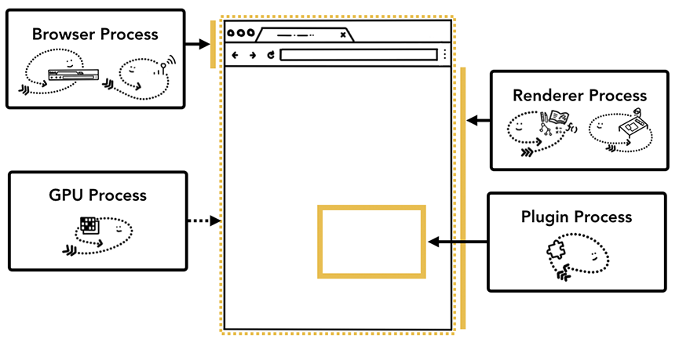
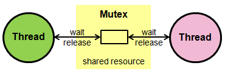

# OS

- 운영체제(OS, Operating System): 사용자가 컴퓨터를 쉽게 다루게 해주는 인터페이스. 한정된 메모리나 시스템 자원을 효율적으로 분배.
- cf) 펌웨어(firmware): 운영체제와 유사하지만 소프트웨어를 추가로 설치할 수 없는 것

## 운영체제와 컴퓨터

### 운영체제의 역할과 구조

- 운영체제의 역할
  1. CPU 스케줄링과 프로세스 관리: CPU 소유권을 어떤 프로세스에 할당할지, 프로세스의 생성과 삭제, 자원 할당 및 반환을 관리
  2. 메모리 관리: 한정된 메모리를 어떤 프로세스에 얼마큼 할당해야 하는지 관리
  3. 디스크 파일 관리: 디스크 파일을 어떠한 방법으로 보관할지 관리
  4. I/O 디바이스 관리: I/O 디바이스들인 마우스, 키보드와 컴퓨터 간에 데이터를 주고 받는 것을 관리
- 운영체제의 구조
  - 유저 프로그램
  - GUI: 사용자가 전자장치와 상호 작용할 수 있도록 하는 사용자 인터페이스의 한 형태, 단순 명령어 창이 아닌 아이콘을 마우스로 클릭하는 단순한 동작으로 컴퓨터와 상호 작용할 수 있도록 해준다.
  - 시스템콜: 
    - 운영체제가 커널에 접근하기 위한 인터페이스
    - 유저 프로그램이 운영체제의 서비스를 받기 위해 커널 함수를 호출할 때 사용
    - 유저 프로그램이 I/O 요청으로 트랩을 발동하면 올바른 I/O 요청인지 확인한 후 유저 모드가 시스템콜을 통해 커널 모드로 변환되어 실행
      - I/O 요청: 입출력 함수, 데이터베이스, 네트워크, 파일 접근 등에 관한 일
    - 하나의 추상화 계층. 이를 통해 네트워크 통신이나 데이터베이스와 같은 낮은 단계의 영역 처리에 대한 부분을 많이 신경 쓰지 않고 프로그램을 구현
    - modebit
      - 시스템콜이 작동될 때 modebit을 참고해서 유저 모드와 커널 모드를 구분한다.
      - 1 또는 0의 값을 가지는 플래그 변수
      - I/O 디바이스는 운영체제를 통해서만 작동해야 한다.(공격자의 악의적인 공격을 막기 위해) => 커널 모드를 통해서 운영체제를 통해 작동한다고 해도 모든 것을 막을 수는 없지만, 이렇게 해야 막기가 쉽다. 이를 위한 것이 modebit이다.
      - 0은 커널모드, 1은 유저모드이며 유저모드일 경우에는 시스템콜을 못하게 막아서 한정된 일만 가능하게 한다.
      - 유저모드: 유저가 접근할 수 있는 영역을 제한적으로 두며 컴퓨터 자원에 함부로 침범하지 못하는 모드
      - 커널모드: 모든 컴퓨터 지원에 접근할 수 있는 모드
      - 커널: 운영체제의 핵심 부분이자 시스템콜 인터페이스를 제공하며 보안, 메모리, 프로세스, 파일 시스템, I/O 디바이스, I/O 요청 관리 등 운영체제의 중추적인 역할을 한다.
  - 커널
  - 드라이버: 하드웨어를 제어하기 위한 소프트웨어
  - 하드웨어
  - 운영체제는 GUI ~ 드라이버이다.
  - cf) GUI가 없고 CUI만 있는 리눅스 서버도 있다. (CUI: 그래픽이 아닌 명령어로 처리하는 인터페이스)

### 컴퓨터의 요소

- 컴퓨터는 CPU, DMA 컨트롤러, 메모리, 타이머, 디바이스 컨트롤러 등으로 이루어져 있다.

- CPU(Central Processing Unit)

  - 산술논리연산장치, 제어장치, 레지스터로 구성되어 있는 컴퓨터 장치

  - 인터럽트에 의해 단순히 메모리에 존재하는 명령어를 해석해서 실행한다.

  - 관리자 역할을 하는 운영체제의 커널이 프로그램을 메모리에 올려 프로세스로 만들면 일꾼인 CPU가 이를 처리한다.

  - 산술논리연산장치(ALU, Arithmetic Logic Unit)

    - 덧셈, 뺄셈 같은 두 숫자의 산술 연산과 배타적 논리합, 논리곱 같은 논리 연산을 계산하는 디지털 회로

  - 제어장치(CU, Control Unit)

    - 프로세스 조작을 지시하는 CPU의 한 부품
    - 입출력장치 간 통신을 제어하고 명령어를 읽고 해석하며 데이터 처리를 위한 순서를 결정한다.

  - 레지스터

    - CPU 안에 있는 매우 빠른 임시기억장치
    - CPU와 직접 연결되어 있으므로 연산속도가 메모리보다 수십 배에서 수백 배까지 빠르다.
    - CPU는 자체적으로 데이터를 저장할 방법이 없기 때문에 레지스터를 통해 데이터를 전달한다.

  - CPU의 연산 처리

    1. 제어장치가 메모리에 계산할 값을 로드. 또한 레지스터에도 로드
    2. 제어장치가 레지스터에 있는 값을 계산하라고 산술논리연산장치에 명령
    3. 제어장치가 계산된 값을 다시 레지스터에서 메모리로 계산한 값을 저장

    - 인터럽트
      - 어떤 신호가 들어왔을 때 CPU를 잠깐 정지시키는 것
      - 키보드, 마우스 등 IO 디바이스로 인한 인터럽트, 0으로 숫자를 나누는 산술 연산에서의 인터럽트, 프로세스 오류 등으로 발생
      - 인터럽트가 발생하면 인터럽트 핸들러 함수가 모여 있는 인터럽트 벡터로 가서 인터럽트 핸들러 함수가 실행
        - 인터럽트 핸들러 함수: 인터럽트가 발생했을 때 이를 핸들링하기 위한 함수, 커널 내부의 IRQ를 통해 호출되며 request_irq()를 통해 인터럽트 핸들러 함수로 등록 가능
      - 인터럽트 간에는 우선순위가 있고 우선순위에 따라 실행되며 인터럽트는 하드웨어 인터럽트, 소프트웨어 인터럽트 두 가지로 나뉨
        - 하드웨어 인터럽트: 키보드를 연결하거나 마우스를 연결하는 등의 IO 디바이스에서 발생하는 인터럽트. 인터럽트 라인이 설계된 이후 순차적인 인터럽트 실행을 중지하고 운영체제에 시스템콜을 요청해서 원하는 디바이스로 향해 디바이스에 있는 작은 로컬 버퍼로 접근하여 일을 수행
        - 소프트웨어 인터럽트: 트랩(trap)이라고도 한다. 프로세스 오류 등으로 프로세스가 시스템콜을 호출할 때 발동한다.

- DMA 컨트롤러

  - I/O 디바이스가 메모리에 직접 접근할 수 있도록 하는 하드웨어 장치
  - CPU에만 너무 많은 인터럽트 요청이 들어오기 때문에 CPU 부하를 막아주며 CPU의 일을 부담하는 보조 일꾼
  - 하나의 작업을 CPU와 DMA 컨트롤러가 동시에 하는 것을 방지

- 메모리

  - 전자회로에서 데이터나 상태, 명령어 등을 기록하는 장치
  - 보통 RAM(Random Access Memory)을 일컬어 메모리라고도 한다.
  - CPU는 계산을 담당하고, 메모리는 기억을 담당
  - 공장에 비유하면 CPU는 일꾼이고, 메모리는 작업장. 작업장의 크기가 클수록 창고에서 물건을 많이 가져다 놓고 많은 일을 할 수 있듯이 메모리가 클수록 많은 일을 동시에 할 수 있다.

- 타이머

  - 몇 초 안에는 작업이 끝나야 한다는 것을 정하고 특정 프로그램에 시간제한을 다는 역할을 한다.
  - 시간이 많이 걸리는 프로그램이 작동할 때 제한을 걸기 위해 존재

- 디바이스 컨트롤러

  - 컴퓨터와 연결되어 있는 IO 디바이스들의 작은 CPU

## 메모리

- CPU는 그저 메모리에 올라와 있는 프로그램의 명령어를 처리할 뿐이다.

### 메모리 계층

- 메모리 계층은 레지스터, 캐시, 메모리, 저장장치로 구성되어 있다. (왼쪽에서 오른쪽으로 갈수록 용량이 커지고, 오른쪽에서 왼쪽으로 갈수록 속도가 빨라진다.)

  - 레지스터: CPU 안에 있는 작은 메모리, 휘발성, 속도가 가장 빠르고, 기억 용량이 가장 적다
  - 캐시: L1, L2 캐시를 지칭. 휘발성, 속도 빠름, 기억 용량이 작다. L3 캐시도 있다.
  - 주기억장치: RAM을 가리킨다. 휘발성, 속보 보통, 기억 용량이 보통
  - 보조기억장치:  HDD, SDD를 일컬으며 휘발성, 속도 낮음, 기억 용량이 많다.

- RAM은 하드디스크로부터 일정량의 데이터를 복사해서 임시 저장하고 이를 필요시마다 CPU에 전달하는 역할을 한다.

- 계층이 위로 올라갈수록 가격은 비싸지는데 용량은 작아지고 속도는 빨라진다.

- 계층의 이유는 경제성 때문이다.

- 로딩 중이라는 것은 하드디스크 또는 인터넷에서 데이터를 읽어 RAM으로 전송하는 과정이 아직 끝나지 않음을 의미한다.

- 캐시

  - 캐시(cache)는 데이터를 미리 복사해 놓는 임시 저장소이자 빠른 장치와 느린 장치에서 속도 차이에 따른 병목 현상을 줄이기 위한 메모리를 말한다.
  - 데이터를 접근하는 시간이 오래 걸리는 경우를 해결하고 무언가를 다시 계산하는 시간을 절약할 수 있다.
  - 메모리와 CPU 사이의 속도 차이가 너무 크기 때문에 그 중간에 레지스터 계층을 두어서 속도 차이를 해결한다. 이렇게 속도 차이를 해결하기 위해 계층과 계층 사이에 있는 계층을 캐시 계층이라고 한다.
  - ex) 캐시 메모리와 보조기억장치 사이에 있는 주기억장치를 보조기억장치의 캐싱계층이라고 할 수 있다.
  - 지역성의 원리
    - 캐시 계층을 두는 것이 아니라 캐시를 직접 설정할 때에는 자주 사용하는 데이터를 기반으로 설정한다.
    - 자주 사용되는 데이터의 기준은 지역성이며, 지역성은 시간 지역성(temporal locality)과 공간 지역성(spatial locality)으로 나뉜다.
    - 시간 지역성: 최근 사용한 데이터에 다시 접근하려는 특성
    - 공간 지역성: 최근 접근한 데이터를 이루고 있는 공간이나 그 가까운 공간에 접근하는 특성

- 캐시히트와 캐시미스

  - 캐시히트: 캐시에서 원하는 데이터를 찾음

  - 캐시미스: 해당 데이터가 캐시에 없다면 주메모리로 가서 데이터를 찾아오는 것

  - 캐시히트를 하게 되면 해당 데이터를 제어장치를 통해 가져오게 된다. 캐시히트의 경우 위치도 가깝고 CPU 내부 버스를 기반으로 작동하기 때문에 빠르다.

  - 캐시미스가 발생하면 메모리에서 가져오게 되는데, 시스템 버스를 기반으로 작동하기 때문에 느리다.

  - 캐시매핑

    - 캐시가 히트되기 위해 매핑하는 방법

    - 레지스터는 주 메모리에 비해 굉장히 작고 주 메모리는 굉장히 크기 때문에 작은 레지스터가 캐시 계층으로 역할을 잘 해주려면 매핑을 어떻게 하느냐가 중요

    - 분류

    - | 이름                                    | 설명                                                         |
      | --------------------------------------- | ------------------------------------------------------------ |
      | 직접 매핑(direct mapping)               | 메모리가 1~100이 있고 캐시가 1~10이 있다면 1:1~10, 2:1~20... 의 식으로 매핑하는 것을 말함. 처리가 빠르지만 충돌 발생이 잦다. |
      | 연관 매핑(associative mapping)          | 순서를 일치시키지 않고 관련 있는 캐시와 메모리를 매핑. 충돌이 적지만 모든 블록을 탐색해야 해서 속도가 느리다. |
      | 집합 관련 매핑(set associative mapping) | 직접 매핑과 연관 매핑을 합쳐 놓은 것. 순서는 일치시키지만 집합을 둬서 저장하며 블록화되어 있기 때문에 검색은 좀 더 효율적이다. 예를 들어 메모리가 1~100이 있고 캐시가 1~10이 있다면 캐시 1~5에는 1~50의 데이터를 무작위로 저장시킨다. |

  - 웹 프라우저의 캐시

    - 작은 저장소 쿠키, 로컬 스토리지, 세션 스토리지
    - 사용자의 커스텀한 정보나 인증 모듈 관련 사항들을 웹 브라우저에 저장해서 추후 서버에 요청할 때 자신을 나타내는 아이덴티티나 중복 요청 방지를 위해 쓰임
    - 쿠키
      - 만료기한이 있는 키-값 저장소
      - smae site 옵션을 strict로 설정하지 않았을 경우 다른 도메인에서 요청했을 때 자동 전송된다.
      - 4KB까지 데이터를 저장할 수 있고 만료기한을 정할 수 있다.
      - 쿠키를 설정할 때는 document.cookie로 쿠키를 볼 수없게 httponly 옵션을 거는 것이 중요
      - 클라이언트 또는 서버에서 만료기한 등을 정할 수 있으며 보통 서버에서 만료기한을 정함
    - 로컬 스토리지
      - 만료기한이 없는 키-값 저장소
      - 10MB까지 저장할 수 있으며 웹 브라우저를 닫아도 유지되고 도메인 단위로 저장, 생성
      - HTML5를 지원하지 않는 웹 브라우저에서는 사용할 수 없으며 클라이언트에서만 수정 가능
    - 세션 스토리지
      - 만료기한이 없는 키-값 저장소
      - 탭 단위로 세션 스토리지를 생성하며, 탭을 닫을 때 해당 데이터가 삭제
      - 5MB까지 저장이 가능하며 HTML5를 지원하지 않는 웹 브라우저에서는 사용할 수 없다.
      - 클라이언트에서만 수정 가능
    - 데이터베이스의 캐싱 계층
      - 메인 데이터베이스 위에 레디스(redis) 데이터베이스 계층을 캐싱 계층으로 둬서 성능을 향상시키기도 한다.

### 메모리 관리

- 가상 메모리(virtual memory)

  - 

  - 메모리 관리 기법의 하나로 컴퓨터가 실제로 이용 가능한 메모리 자원을 추상화하여 이를 사용하는 사용자들에게 매우 큰 메모리로 보이게 만드는 것

  - 가상적으로 주어진 주소를 가상 주소(logical address)라고 하며, 실제 메모리상에 있는 주소를 실제 주소(physical memory)라고 한다.

  - 가상 주소는 메모리관리장치(MMU)에 의해 실제 주소로 변환되며, 이 덕분에 사용자는 실제 주소를 의식할 필요 없이 프로그램을 구축할 수 있게 된다.

  - 가상 메모리는 가상 주소와 실제 주소가 매핑되어 있고 프로세스의 주소 정보가 들어 있는 페이지 테이블로 관리가 된다. 이 때, 속도 향상을 위해 TLB를 사용한다.

    - TLB(Translation Lookaside Buffer): 메모리와 CPU 사이에 있는 주소 변환을 위한 캐시. 페이지 테이블에 있는 리스트를 보관하며 CPU가 페이지 테이블까지 가지 않도록 해 속도를 향상시킬 수 있는 캐시 계층

  - 스와핑

    - 만약 가상 메모리에는 존재하지만 실제 메모리인 RAM에는 현재 없는 데이터나 코드에 접근할 경우 페이지 폴트가 발생한다. 
    - 이를 방지하기 위해 당장 사용하지 않는 영역을 하드디스크로 옮겨 필요할 때 다시 RAM으로 불러와 올리고, 사용하지 않으면  다시 하드디스크로 내림을 반복하여 RAM을 효과적으로 관리하는 것을 스와핑이라 한다.

  - 페이지 폴트

    - 프로세스의 주소 공간에는 존재하지만 지금 이 컴퓨터의 RAM에는 없는 데이터에 접근할 경우에 발생

    - 운영체제는 다음 과정으로 해당 데이터를 메모리로 가져와서 마치 페이지 폴트가 전혀 발생하지 않은 것처럼 프로그램이 작동하게 한다.

      1. CPU는 물리 메모리를 확인하여 해당 페이지가 없으면 트랩을 발생해서 운영체제에 알린다.
      2. 운영체제는 CPU의 동작을 잠시 멈춘다.
      3. 운영체제는 페이지 테이블을 확인하여 가상 메모리에 페이지가 존재하는지 확인하고, 없으면 프로세스를 중단하고 현재 물리 메모리에 비어 있는 프레임이 있는지 찾는다. 물리 메모리에도 없다면 스와핑이 발동한다.
      4. 비어 있는 프레임에 해당 페이지를 로드하고, 페이지 테이블을 최신화한다.
      5. 중단되었던 CPU를 다시 시작한다.

      - 페이지: 가상 메모리를 사용하는 최소 크기 단위
      - 프레임: 실제 메모리를 사용하는 최소 크기 단위

- 스레싱(thrashing)

  - 
  - 메모리의 페이지 폴트율이 높은 것. 컴퓨터의 심각한 성능 저하를 초래
  - 메모리에 너무 많은 프로세스가 동시에 올라가게 되면 스와핑이 많이 일어나서 발생
  - 페이지 폴트가 일어나면 CPU 이용률이 낮아지고, 운영체제는 CPU가 한가하다고 생각해서 가용성을 더 높이기 위해 더 많은 프로세스를 메모리에 올리게 된다. 이러한 악순환이 반복되어 스레싱이 발생하게 된다.
  - 해결하기 위해서는 메모리를 늘리거나, HDD를 사용한다면 SDD로 바꾸는 방법이 있다.
  - 운영체제에서 해결할 수 있는 방법은 작업세트와 PFF가 있다.
  - 작업세트(working set)
    - 프로세스의 과거 사용 이력인 지역성(locality)을 통해 결정된 페이지 집합을 만들어서 미리 메모리에 로드하는 것
    - 미리 메모리에 로드하면 탐색에 드는 비용을 줄일 수 있고 스와핑 또한 줄일 수 있다.
  - PFF(Page Fault Frequency)
    - 페이지 폴트 빈도를 조정하는 방법으로 상한선과 하한선을 만드는 방법
    - 상한선에 도달하면 페이지를 늘리고 하한선에 도달하면 페이지를 줄이는 방법

- 메모리 할당

  - 

  - 메모리에 프로그램을 할당할 때는 시작 메모리 위치, 메모리의 할당 크기를 기반으로 할당

  - 연속 할당과 불연속 할당으로 나뉜다.

  - 연속 할당(contiguous memory allocation)

    - 메모리에 '연속적으로' 공간을 할당하는 것

    - 순차적으로 공간에 프로세스를 할당

    - 메모리를 미리 나누어 관리하는 고정 분할 방식과 매  시점 프로그램의 크기에 맞게 메모리를 분할하여 사용하는 가변 분할 방식이 있다.

    - 고정 분할 방식(fixed partition allocation)

      - 메모리를 미리 나누어 관리하는 방식
      - 메모리가 미리 나누어 있기 때문에 융통성이 없음 내부 단편화가 발생

    - 가변 분할 방식(variable partition allocation)

      - 매 시점 프로그램의 크기에 맞게 동적으로 메모리를 나누어 사용

      - 내부 단편화는 발생하지 않고 외부 단편화는 발생할 수 있음

      - 최초적합(first fix), 최적적합(best fit), 최악적합(worst fit)이 있다.

      - | 이름     | 설명                                                 |
        | -------- | ---------------------------------------------------- |
        | 최초적합 | 위쪽이나 아래쪽부터 시작해서 홀을 찾으면 바로 할당   |
        | 최적적합 | 프로세스의 크기 이상인 공간 중 가장 작은 홀부터 할당 |
        | 최악적합 | 프로세스의 크기와 가장 차이가 나는홀데 할당          |

    - 내부단편화(internal fragmentation): 메모리를 나눈 크기보다 프로그램이 작아서 들어가지 못하는 공간이 많이 발생하는 현상(빈공간(낭비)가 많이 발생)

    - 외부단편화(external fragmentation): 메모리를 나눈 크기보다 프로그램이 커서 들어가지 못하는 공간이 많이 발생하는 현상, 예를 들어 100MB를 55MB, 45MB로 나누었지만 프로그램의 크기가 70MB일 때 들어가지 못하는 것

    - 홀(hole): 할당할 수 있는 비어 있는 메모리 공간

  - 불연속 할당

    - 메모리를 연속적으로 할당하지 않음
    - 현대 운영체제가 쓰는 방법으로 불연속 할당인 페이징 기법이 있다. 메모리를 동일한 크기의 페이지(보통 4KB)로 나누고 프로그램마다 페이지 테이블을 두어 이를 통해 메모리에 프로그램을 할당
    - 이 외에도 세그멘테이션, 페이지드 세그멘테이션이 있다.
    - 페이징
      - 동일한 크기의 페이지 단위로 나누어 메모리의 서로 다른 위치에 프로세스를 할당
      - 홀의 크기가 균일하지 않은 문제가 없어지지만 주소 변환이 복잡해진다
    - 세그멘테이션
      - 페이지 단위가 아닌 의미 단위인 세그멘트로 나누는 방식
      - 프로세스는 코드, 데이터, 스택, 힙 등으로 이루어지는데 코드와 데이터 등 이를 기반으로 나눌 수도 있으며 함수 단위로 나눌 수도 있음을 의미
      - 공유와 보안 측면에서 좋으며 홀 크기가 균일하지 않은 문제가 발생
    - 페이지드 세그멘테이션
      - 공유냐 보안을 의미 단위인 세그먼트로 나누고, 물리적 메모리는 페이지로 나누는 것

- 페이지 교체 알고리즘

  - 오프라인 알고리즘
    - 먼 미래에 참조되는 페이지와 현재 할당되는 페이지를 바꾸는 알고리즘
    - 하지만 미래에 사용될 프로세스를 알 수는 없기에 불가능하다.
    - 다른 알고리즘과의 성능 비교에 대한 기준을 제공
  - FIFO(First In First Out)
    - 가장 먼저 온 페이지를 교체 영역에 가장 먼저 놓는 방법
  - LRU(Least Recentle Used)
    - 참조가 가장 오래된 페이지를 바꾼다.
    - '오래된' 것을 파악하기 위해 각 페이지마다 계수기, 스택을 두어야 하는 문제점이 있다.
    - 프로그램으로 구현시 보통 두 개의 자료구조로 구현한다. 해시 테이블과 이중 연결 리스트를 사용한다.
      - 해시 테이블은 이중 연결 리스트에서 빠르게 찾을 수 있도록 쓴다.
      - 이중 연결 리스트는 한정된 메모리를 나타낸다.
  - NUR(Not Used Recently)
    - clock 알고리즘이라고 하며 먼저 0과 1을 가진 비트를 둔다. 1은 최근에 참조되었고 0은 참조되지 않음을 의미한다.
    - 시계 방향으로 돌면서 0을 찾고 0을 찾은 순간 해당 프로세스를 교체하고, 해당 부분을 1로 바꾸는 알고리즘이다.
  - LFU(Least Frequently Used)
    - 가장 참조 횟수가 적은 페이지를 교체한다. 많이 사용되지 않은 것을 교체하는 것

## 프로세스와 스레드

- 프로세스: 컴퓨터에서 실행되고 있는 프로그램.  CPU 스케줄링의 대상이 되는 작업(task)와 거의 같은 의미로 사용.
- 스레드: 프로세스 내 작업의 흐름

- 프로그램이 메모리에 올라가면 프로세스가 되는 인스턴스화가 일어나고, 이후 운영체제의 CPU 스케줄러에 따라 CPU가 프로세스를 실행한다.

### 프로세스와 컴파일 과정

- 프로세스는 프로그램으로부터 인스턴스화된 것을 말한다.
- ex) 프로그램은 .exe와 같은 실행파일이며, 이를 두 번 클릭하면 ..'프로세스'가 되는 것이다.
- (C 언어 기반의)프로그램: 컴파일러가 컴파일 과정을 거쳐 컴퓨터가 이해할 수 있는 기계어로 번역되어 실행될 수 있는 파일이 되는 것
- 컴파일 과정: 소스 코드 파일 => 전처리 => 컴파일러 => 어셈블리어 => 어셈블러 => 목적 코드 + 라이브러리 => 링커 => 실행 가능한 파일
- 전처리: 소스 코드의 주석을 제거하고 #include 등 헤더 파일을 병합하여 매크로를 치환한다.
- 컴파일러: 오류 처리, 코드 최적화 작업을 하며 어셈블리어로 변환
- 어셈블러: 어셈블리어는 목적 코드로 변환된다. 이 때 확장자는 운영체제마다 다른데 예를 들어 리눅스에서는 .o이다.
- 링커: 프로그램 내에 있는 라이브러리 함수 또는 다른 파일들과 목적 코드를 결합하여 실행 파일을 만든다. 실행 파일의 확장자는 .exe 또는 .out이라는 확장자를 갖는다.
- 라이브러리는 동적 라이브러리와 정적 라이브러리로 나뉜다.
  - 정적 라이브러리
    - 프로그램 빌드 시 라이브러리가 제공하는 모든 코드를 실행 파일에 넣는 방식
    - 시스템 환경 등 외부 의존도가 낮고 코드 중복 등 메모리 효율성이 떨어지는 단점
  - 동적 라이브러리
    - 프로그램 실행 시 필요할 때만 DLL이라는 함수 정보를 통해 참조하는 방식
    - 메모리 효율성에서의 장점
    - 외부 의존도가 높아진다는 단점

### 프로세스의 상태

- 생성 상태(create)
  - 프로세스가 생성된 상태
  - fork()나 exec()함수를 통해 생성. 이 때 PCB(Process Control Block)가 할당
    - PCB: 운영체제가 프로세스를 제어하기 위해 정보를 저장해 놓는 곳, 프로세스의 상태 정보를 저장하는 자료구조
  - fork()
    - 부모 프로세스의 주소 공간을 그대로 복사하며, 새로운 자식 프로세스를 생성
    - 주소 공간만 복사할 뿐이지 부모 프로세스의 비동기 작업 등을 상속하지는 않는다.
  - exec()
    - 새롭게 프로세스를 생성하는 함수
- 대기 상태(ready)
  - 메모리 공간이 충분하면 메모리를 할당받고 아니면 아닌 상태로 대기하고 있으며 CPU 스케줄러로부터 CPU 소유권이 넘어오기를 기다리는 상태
- 대기 중단 상태(ready suspended)
  - 메모리 부족으로 일시 중단된 상태
- 실행 상태(running)
  - CPU 소유권과 메모리를 할당받고 인스트럭션을 수행 중인 상태
  - CPU burst가 일어났다고도 표현
- 중단 상태(blocked)
  - 어떤 이벤트가 발생한 이후 기다리면 프로세스가 차단된 상태
  -  I/O 디바이스에 의한 인터럽트로 이런 현상이 많이 발생하기도 함
- 일시 중단 상태(blocked suspended)
  - 대기 중단과 유사
  - 중단된 상태에서 프로세스가 실행되려고 했지만 메모리 부족으로 인해 일시 중단된 상태
- 종료 상태(terminated)
  - 메모리와 CPU 소유권을 모두 놓고 가는 상태
  - 자연스러운 종료도 있지만 부모 프로세스가 자식 프로세스를 강제시키는 비자발적 종료(abort)로 끝나는 경우도 있다.
  - 자식 프로세스에 할당된 자원의 한계치를 넘어서거나 부모 프로세스가 종료되거나 사용자가 process.kill 등 여러 명령어로 프로세스를 종료할 때 발생

### 프로세스의 메모리 구조

- 스택(stack), 힙(heap), 데이터 영역(BSS segment, Data segment), 코드 영역으로 나누어진다.
- 스택은 위 주소부터 할당되고 힙은 아래주소부터 할당된다.
- 스택
  - 스택에는 지역변수, 매개변수, 함수가 저장되고 **컴파일** 시에 크기가 결정되며 '동적'인 특징을 갖는다.
  - 스택 영역은 함수가 함수를 재귀적으로 호출하면서 동적으로 크기가 늘어날 수 있는데, 이 때 힙과 스택의 메모리 영역이 겹치면 안 되기 때문에 힙과 스택 사이의 공간을 비워 놓는다.
- 힙
  - 동적 할당할 때 사용되며 **런타임** 시 크기가 결정된다.
  - 예를 들어 벡터 같은 동적 배열은 힙에 동적 할당된다.
  - 동적인 특징을 갖는다.
- 데이터 영역
  - 전역변수, 정적변수가 저장되고, 정적인 특징을 갖는 프로그램이 종료되면 사라지는 변수가 들어 있는 영역
  - BSS 영역과 Data 영역으로 나뉜다.
  - BSS 영역: 초기화가 되지 않은 변수가 0으로 초기화되어 저장된다.
  - Data 영역: 0이 아닌 다른 값으로 할당된 변수들이 저장된다.
- 코드 영역
  - 프로그램에 내장되어 있는 소스 코드가 들어가는 영역
  - 수정 불가능한 기계어로 저장되어 있으며 정적인 특징을 가진다.

### PCB(Process Control Block)

- 운영체제에서 프로세스에 대한 메타데이터를 저장한 '데이터'
- 프로세스 제어 블록이라고도 한다.
- 프로세스가 생성되면 운영체제는 해당 PCB를 생성한다.
- 프로그램이 실행되면 프로세스가 생성되고 프로세스 주소 값들에 앞서 설명한 스택, 힙 등의 구조를 기반으로 메모리가 할당된다. 그리고 이 프로세스의 메타데이터들이 PCB에 저장되어 관리된다. 이는 프로세스의 중요한 정보를 포함하고 있기 때문에 일반 사용자가 접근하지 못하도록 커널 스택의 가장 앞부분에서 관리된다.
  - 메타데이터: 데이터에 관한 구조화된 데이터로 다른 데이터를 설명하는 작은 데이터, 대량의 정보 가운데에서 찾고 있는 정보를 효율적으로 찾아내서 이용하기 위해 일정한 규칙에 따라 컨텐츠에 대해 부여되는 데이터
- PCB의 구조
  - 프로세스 스케줄링 상태: 준비, 일시중단 등 프로세스가 CPU에 대한 소유권을 얻은 이후의 상태
  - 프로세스 ID: 프로세스 ID, 해당 프로세스의 자식 프로세스 ID
  - 프로세스 권한: 컴퓨터 자원 또는 I/O 디바이스에 대한 권한 정보
  - 프로그램 카운터: 프로세스에서 실행해야 할 다음 명령어의 주소에 대한 포인터
  - CPU 레지스터: 프로세스를 실행하기 위해 저장해야 할 레지스터에 대한 정보
  - CPU 스케줄링 정보: CPU 스케줄러에 의해 중단된 시간 등에 대한 정보
  - 계정 정보: 프로세스 실행에 사용된 CPU 사용량, 실행한 유저의 정보
  - I/O 상태 정보: 프로세스에 할당된 I/O 디바이스 목록

- 컨텍스트 스위칭
  - PCB를 교환하는 과정
  - 한 프로세스에 할당된 시간이 끝나거나 인터럽트에 의해 발생
  - 컴퓨터는 많은 프로그램을 동시에 실행하는 것처럼 보이지만 어떠한 시점에 실행되고 있는 프로세스는 단 한개이다.(싱글코어를 가정하고)
  - 많은 프로세스가 동시에 구동되는 것처럼 보이는 것은 다른 프로세스와의 컨텍스트 스위칭이 빠르게 이루어지기 때문이다.
  - 
  - 프로세스 P0를 실행하다 멈추고, P0의 PCB를 저장하고 프로세스 P1을 로드하여 실행한다. 프로세스 P1을 저장하고 다시 프로세스 P0를 실행한다. 위의 그림에서 컨텍스트 스위칭이 일어날 때, 유휴 시간(idle time)이 발생하는 것을 볼 수 있다. 이 외에도 컨텍스트 스위칭에서 캐시미스라는 비용이 발생한다.
  - 캐시미스
    - 컨텍스트 스위칭이 일어날 때 프로세스가 가지고 있는 메모리 주소가 그대로 있으면 잘못된 주소 변환이 생기므로 캐시클리어 과정을 겪게 되고 캐시미스가 발생한다.
  - 스레드에서의 컨텍스트 스위칭
    - 스레드에서도 컨텍스트 스위칭이 나타난다. 스레드는 스택 영역을 제외한 모든 메모리를 공유하기 때문에 스레드 컨텍스트 스위칭의 경우 비용이 더 적고 시간도 더 적게 걸린다.

### 멀티프로세싱

- 여러 개의 프로세스를 통해 동시에 두 가지 이상의 일을 수행할 수 있는 것

- 하나 이상의 일을 병렬로 처리할 수 있으며 특정 프로세스의 메모리, 프로세스 중 일부에 문제가 발생되더라도 다른 프로세스를 이용해서 처리할 수 있기에 신뢰성이 높은 강점이 있다.

- 웹 브라우저

  - 

  - 브라우저 프로세스: 주소 표시줄, 북마크 막대, 뒤로 가기 버튼, 앞으로 가기 버튼 등을 담당하며 네트워크 요청이나 파일 접근 같은 권한을 담당한다.
  - 렌더러 프로세스: 웹 사이트가 보이는 부분의 모든 것을 제어
  - 플러그인 프로세스: 웹 사이트에서 사용하는 플러그인을 제어
  - GPU 프로세스: GPU를 이용해서 화면을 그리는 부분을 제어

- IPC(Inter Process Communication)

  - 프로세스끼리 데이터를 주고받고 공유 데이터를 관리하는 메커니즘
  - ex) 클라이언트가 서버에 데이터를 요청하고 서버는 클라이언트의 요청에 응답하는 것
  - IPC의 종류: 공유 메모리, 파일, 소켓, 익명 파이프, 명명 파이프, 메시지 큐 - 메모리가 완전히 공유되는 스레드보다 속도가 떨어진다
  - 공유 메모리
    - 여러 프로세스에 동일한 메모리 블록에 대한 접근 권한이 부여되어 프로세스가 서로 통신할 수 있도록 공유 버퍼를 생성하는 것
    - 기본적으로는 각 프로세스의 메모리를 다른 프로세스가 접근할 수 없지만 공유 메모리를 통해 여러 프로세스가 하나의 메모리를 공유할 수 있다.
    - 어떠한 매개체를 통해 데이터를 주고 받는 것이 아니라 메모리 자체를 공유하기 때문에 불필요한 데이터 복사의 오버헤드가 발생하지 않아 가장 빠르고 같은 메모리 영역을 여러 프로세스가 공유하기 때문에 동기화가 필요하다.
    - 하드웨어 관점에서 공유 메모리는 CPU가 접근할 수 있는 큰 랜덤 메모리인 RAM을 가리키기도 한다.
  - 파일
    - 디스크에 저장된 데이터 또는 파일 서버에서 제공한 데이터. 이를 기반으로 프로세스 간 통신을 한다.
  - 소켓
    - 동일한 컴퓨터의 다른 프로세스나 네트워크의 다른 컴퓨터로 네트워크 인터페이스를 통해 전송하는 데이터를 의미
    - TCP와 UDP가 있다.
  - 익명 파이프(unnamed pipe)
    - 
    - 프로세스 간에 FIFO 방식으로 일깋는 임시 공간이 파이프를 기반으로 데이터를 주고 받으며, 단방향 방식의 읽기 전용, 쓰기 전용 파이프를 만들어서 작동하는 방식
    - 부모, 자식 프로세스 간에만 사용할 수 있으며 다른 네트워크 상에서는 사용이 불가능하다.
  - 명명된 파이프(named pipe)
    - 
    - 파이프 서버와 하나 이상의 파이프 클라이언트 간의 통신을 위한 명명된 단방향 또는 이중 파이프를 말한다.
    - 클라이언트/서버 통신을 위한 별도의 파이프를 제공하며, 여러 파이프를 동시에 사용할 수 있다.
    - 컴퓨터의 프로세스끼리 또는 다른 네트워크 상의 컴퓨터와도 통신을 할 수 있다.
    - 서버용 파이프와 클라이언트용 파이프로 구분해서 작동하며 하나의 인스턴스를 열거나 여러 개의 인스턴스를 기반으로 통신
  - 메시지 큐
    - 메시지를 큐 데이터 구조 형태로 관리한느 것
    - 커널의 전역변수 형태 등 커널에서 전역적으로 관리
    - 다른 IPC 방식에 비해 사용 방법이 매우 직관적, 간단
    - 다른 코드의 수정 없이 단지 몇 줄의 코드를 추가시켜 간단하게 메시지 큐에 접근할 수 있다
    - 공유 메모리를 통해 IPC를 구현할 때 쓰기 및 읽기 빈도가 높으면 동기화 때문에 기능을 구현하는 것이 매우 복잡해지는데, 이때 대안으로 메시지 큐를 사용하기도 한다.

### 스레드와 멀티태스킹

- 스레드
  - 프로세스의 실행 가능한 가장 작은 단위
  - 프로세스는 여러 스레드를 가질 수 있다.
  - 스레드는 코드, 데이터, 힙은 스레드끼리 서로 공유한다. 그 외의 영역은 각각 생성된다.
- 멀티스레딩
  - 프로세스 내 작업을 여러 개의 스레드(멀티스레드)로 처리하는 기법
  - 스레드끼리 서로 자원을 공유하기 때문에 효율성이 높다.
  - 동시성 장점
    - 동시성: 서로 독립적인 작업들을 작은 단위로 나누고 동시에 실행되는 것처럼 보여주는 것
  - 한 스레드에 문제가 생기면 다른 스레드에도 영향을 끼쳐 스레드로 이루어져 있는 프로세스에 영향을 줄 수 있는 단점

### 공유 자원과 임계 영역

- 공유 자원(shared resource)

  - 시스템 안에서 각 프로세스, 스레드가 함께 접근할 수 있는 모니터, 프린터, 메모리, 파일, 데이터 등의 자원이나 변수 등을 의미
  - 경쟁 상태(race condition): 공유 자원을 두 개 이상의 프로세스가 동시에 읽거나 쓰는 상황
  - 

- 임계 영역(critical section)

  - 공유 자원에 접근할 때 순서 등의 이유로 결과가 달라지는 영역
  - 해결하기 위한 방법: 뮤텍스, 세마포어, 모니터 (모두 상호 배제, 한정 대기, 융통성의 조건 만족)
    - 상호 배제(mutual exclusion): 한 프로세스가 임계 영역에 들어갔을 때 다른 프로세스는 들어갈 수 없다.
    - 한정 대기(bounded waiting): 특정 프로세스가 영원히 임계 영역에 들어가지 못하면 안 된다.
    - 융통성(flexibility): 한 프로세스가 다른 프로세스의 일을 방해해서는 안 된다.

  - 뮤텍스(mutex)
    - 공유 자원을 사용하기 전에 설정하고 사용한 후에 해제하는 잠금
    - 잠금이 설정되면 다른 스레드는 잠긴 코드 영역에 접근할 수 없다.
    - 뮤텍스는 하나의 상태(잠금 또는 잠금 해제)만 가진다.
    - 
  - 세마포어(semaphore)
    - 일반화된 뮤텍스
    - 간단한 정수 값과 두 가지 함수 wait(P 함수), signal(V 함수)로 공유 자원에 대한 접근을 처리
    - wait()는 자신의 차례가 올 때까지 기다리는 함수
    - signal()은 다음 프로세스로 순서를 넘겨주는 함수
    - 
    - 프로세스가 공유 자원에 접근하면 세마포어에서 wait() 작업을 수행하고 프로세스가 공유 자원을 해제하면 세마포어에서 signal() 작업을 수행한다.
    - 세마포어에는 조건 변수가 없고 프로세스가 세마포어 값을 수정할 때 다른 프로세스는 동시에 세마포어 값을 수정할 수 없다.
    - 바이너리 세마포어
      - 0과 1의 두가지 값만 가질 수 있는 세마포어
      - 구현의 유사성으로 뮤텍스는 바이너리 세마포어라고 할 수 있다. 단, 뮤텍스는 리소스에 대한 접근을 동기화하는 데 사용되는 잠금 메커니즘이고, 세마포어는 신호를 기반으로 상호 배제가 일어나는 신호 메커니즘이다.
    - 카운팅 세마포어
      - 여러 개의 값을 가질 수 있는 세마포어
      - 여러 자원에 대한 접근을 제어하는 데 사용
  - 모니터
    - 둘 이상의 스레드나 프로세스가 공유 자원에 안전하게 접근할 수 있도록 공유 자원을 숨기고 해당 접근에 대해 인터페이스만 제공
    - 세마포어보다 구현하기 쉽다.(모니터는 상호 배제가 자동인데 비해 세마포어는 상호 배제를 명시적으로 구현해야 한다.)

### 교착 상태(deadlock)

- 두 개 이상의 프로세스들이 서로가 가진 자원을 기다리며 중단된 상태
- ex) 프로세스 A가 B의 어떤 자원을 요청할 때, 프로세스 B도 A의 어떤 자원을 요청하는 것
- 교착 상태의 원인
  - 상호 배제: 한 프로세스가 자원을 독점하고 있으며 다른 프로세스들은 접근이 불가
  - 점유 대기: 특정 프로세스가 점유한 자원을 다른 프로세스가 요청하는 상태
  - 비선점: 다른 프로세스의 자원을 강제적으로 가져올 수 없다.
  - 환형 대기: 프로세스 A는 프로세스 B의 자원을 요청하고, 프로세스 B는 프로세스 A의 자원을 요청하는 등 서로가 서로의 자원을 요구하는 상황
- 교착 상태의 해결 방법(순서가 아니라 각 방법)
  1. 자원을 할당할 때 애초에 조건이 성립되지 않도록 설계
  2. 교착 상태 가능성이 없을 때만 자원 할당되며, 프로세스당 요청할 지원들의 최대치를 통해 자원 할당 가능 여부를 파악하는 '은행원 알고리즘'을 사용
     - 은행원 알고리즘: 총 자원의 양과 현재 할당한 자원의 양을 기준으로 안정 또는 불안정 상태로 나누고 안정 상태로 가도록 자원을 할당하는 알고리즘
  3. 교착 상태가 발생하면 사이클이 있는지 찾아보고 이에 관련된 프로세스를 한 개씩 지운다.
  4. 교착 상태는 드물게 일어나기 때문에 이를 처리하는 비용이 더 커서 교착 상태가 발생하면 사용자가 작업을 종료한다. 현대 운영체제는 이 방법을 선택했다.

## CPU 스케줄링 알고리즘

- CPU 스케줄러는 CPU 스케줄링 알고리즘에 따라 프로세스에서 해야 하는 일을 스레드 단위로 CPU에 할당한다.
- 
- 프로그램이 실행될 때는 CPU 스케줄링 알고리즘이 어떤 프로그램에 CPU 소유권을 줄 것인지를 결정한다.
- 이 알고리즘은 CPU 이용률은 높게, 주어진 시간에 많은 일을 하게, 준비 큐에 있는 프로세스는 적게, 응답 시간은 짧게 설정하는 것을 목표로 한다.

### 선점형 방식(preemptive)

- 현대 운영체제가 쓰는 방식
- 지금 사용하고 있는 프로세스를 알고리즘에 의해 중단시키고 다른 프로세스에 CPU 소유권을 할당하는 방식
- 라운드 로빈(RR, Round Robin)
  - 현대 컴퓨터가 쓰는 스케줄링인 우선순위 스케줄링의 일종으로 각 프로세스는 동일한 할당 시간을 주고 그 시간 안에 끝나지 않으면 다시 준비 큐(ready queue)의 뒤로 가는 알고리즘
  - 일반적으로 전체 작업 시간은 길어지지만 평균 응답 시간은 짧아진다는 특징이 있다.
  - 로드밸런서에서 트래픽 분산 알고리즘으로도 쓰인다.
- SRF(Shortest Remaining job Frist)
  - 중간에 더 짧은 작업이 들어오면 수행하던 프로세스를 중지하고 해당 프로세스를 수행하는 알고리즘
- 다단계 큐(Multilevel feedback queue)
  - 
  - 우선순위에 따른 큐를 여러 개 사용하고, 큐마다 라운드 로빈이나 FCFS 등 다른 스케줄링 알고리즘을 적용한 것
  - 큐 간의 프로세스 이동이 안 되므로 스케줄링 부담이 적지만 유연성이 떨어지는 특징이 있다.

### 비선점형 방식(non-preemptive)

- 프로세스가 스스로 CPU 소유권을 포기하는 방식. 강제로 프로세스를 중지하지 않음
- 컨텍스트 스위칭으로 인한 부하가 적다.
- FCFS(First Come, First Served)
  - 가장 먼저 온 것을 가장 먼저 처리하는 알고리즘
  - 길게 수행되는 프로세스 때문에 준비 큐에서 오래 기다리는 현상(convoy effect)이 발생하는 단점이 있다.
- SJF(Shortest Job First)
  - 실행 시간이 가장 짧은 프로세스를 가장 먼저 실행하는 알고리즘
  - 긴 시간을 가진 프로세스가 실행되지 않는 현상(starvation)이 일어나며 평균 대기 시간이 가장 짧다.
  - 실제로는 실행 시간을 알 수 없기 때문에 과거의 실행했던 시간을 토대로 추측해서 사용
- 우선순위
  - 오래된 작업일수록 우선순위를 높이는 방법(aging)을 통해 단점을 보완한 알고리즘

