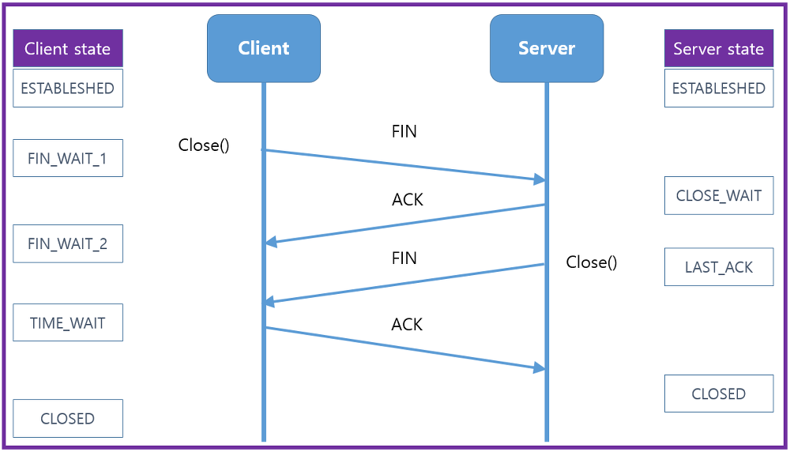
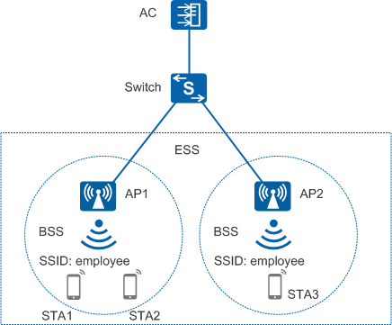
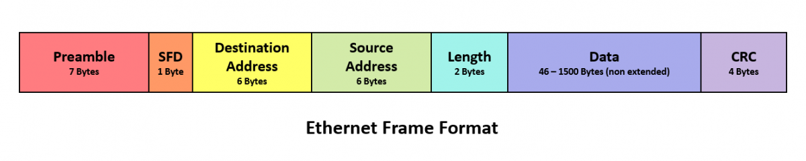
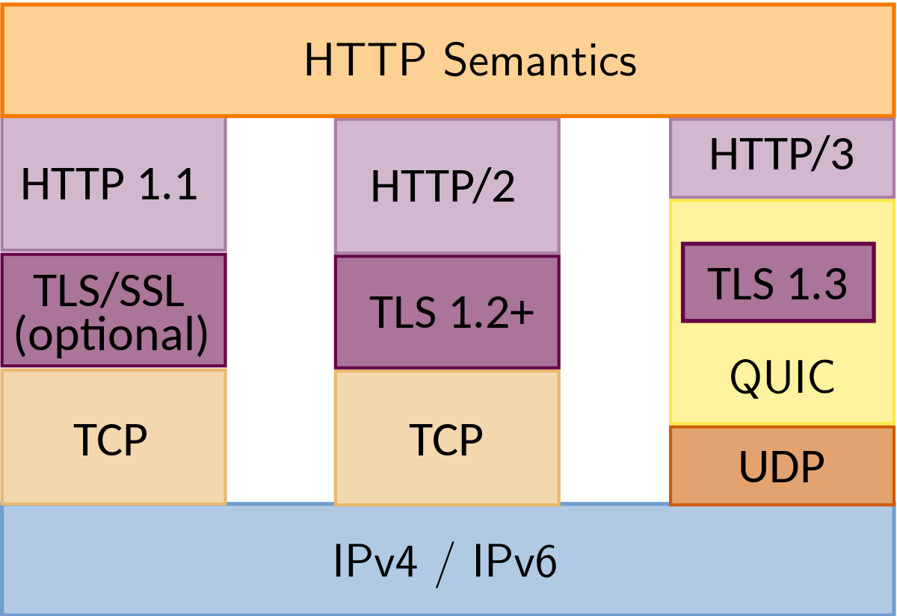

# 네트워크

## 네트워크의 기초

- 네트워크란?
  - 컴퓨터 등의 장치들이 통신 기술을 이용하여 구축하는 연결망
  - 노드와 링크가 서로 연결되어 있거나 연결되어 있지 않은 집합체
  - 노드: 서버, 라우터, 스위치 등 네트워크 장치
  - 링크: 유선 또는 무선

### 처리량과 지연 시간

- '좋은' 네트워크: 많은 처리량을 처리할 수 있고 지연 시간이 짧고 장애 빈도가 적으며 좋은 보안을 갖춘 네트워크

  - 처리량(throughput)
    - 링크를 통해 전달되는 단위 시간당 데이터양
    - 단위: bps(bits per second)
    - 영향 요소
      - 사용자들이 많이 접속할 때마다 커지는 트래픽
      - 네트워크 장치 간의 대역폭(주어진 시간 동안 네트워크 연결을 통해 흐를 수 있는 최대 비트 수)
      - 네트워크 중간에 발생하는 에러
      - 장치의 하드웨어 스펙

  - 지연 시간(latency)
    - 요청이 처리되는 시간, 어떤 메시지가 두 장치 사이를 왕복하는 데 걸린 시간
    - 영향 요소
      - 매체 타입(무선, 유선)
      - 패킷 크기
      - 라우터의 패킷 처리 시간

### 네트워크 토폴로지와 병목 현상

- 네트워크 토폴로지
  - 노드와 링크가 어떻게 배치되어 있는지에 대한 방식, 연결 형태
- 트리 토폴로지(계층형 토폴로지)
  - 트리 형태로 배치한 네트워크 구성
  - 노드의 추가, 삭제가 쉬우며 특정 노드에 트래픽이 집중될 때 하위 노드의 영향을 받을 수 있다.
- 버스 토폴로지
  - 중앙 통신 회선 하나에 여러 개의 노드가 연결되어 공유하는 네트워크 구성
  - 근거리 통신망(LAN)에서 사용
  - 설치 비용이 적고 신뢰성이 우수하며 중앙 통신 회선에 노드를 추가하거나 삭제하기 쉽다
  - 스푸핑이 가능한 문제점이 있다
  - 스푸핑
    - LAN 상에서 송신부의 패킷을 송신과 관련 없는 다른 호스트에게 가지 않도록 하는 스위칭 기능을 마비시키거나 속여서 특정 노드에 해당 패킷이 오도록 처리하는 것
    - 올바르게 수신부로 가야할 패킷이 악의적인 노드에 전달되게 된다
- 스타 토폴로지
  - 중앙에 있는 노드에 모두 연결된 네트워크 구성-
- 병목(bottleneck) 현상
  - 전체 시스템의 성능이나 용량이 하나의 구성 요소로 인해 제한을 받는 현상
  - 서비스에서 이벤트를 열었을 때 트래픽이 많이 생기고 그 트래픽을 잘 관리하지 못하면 병목 현상이 생겨 사용자는 웹 사이트로 들어가지 못한다.

### 네트워크 분류

- 규모를 기반으로 분류
- LAN(Local Area Network) - 사무실과 개인적으로 소유 가능한 규모
  - 근거리 통신망
  - 같은 건물이나 캠퍼스 같은 좁은 공간에서 운영
  - 전송 속도가 빠르고 혼잡하지 않음
- MAN(Metropolitan Area Network) - 시 정도의 규모
  - 대도시 지역 네트워크를 나타내며 도시 같은 넓은 지역에서 운영
  - 전송 속도는 평균, LAN보다는 더 많이 혼잡
- WAN(Wide Area Network) - 세계 규모
  - 광역 네트워크
  - 국가 또는 대륙 같은 더 넓은 지역에서 운영
  - 전송 속도는 낮으며, MAN보다 더 혼잡

### 네트워크 성능 분석 명령어

- 네트워크 병목 현상의 주된 원인

  - 네트워크 대역폭

  - 네트워크 토폴로지

  - 서버 CPU, 메모리 사용량

  - 비효율적인 네트워크 구성

  - ping(Packet INternet Groper)

    - 네트워크 상태를 확인하려는 대상 노드를 향해 일정 크기의 패킷을 전송하는 명령어
    - 해당 노드의 패킷 수신 상태와 도달하기까지 시간 등을 알 수 있으며 해당 노드까지 네트워크가 잘 연결되어 있는지 확인 가능
    - TCP/IP 프로토콜 중에 ICMP 프로토콜을 통해 동작 => ICMP 프로토콜을 지원하지 않는 대상으로는 실행할 수 없거나 네트워크 정책상 ICMP나 traceroute를 차단하는 대상의 경우 ping 테스팅은 불가

    ``` 
    ping www.google.com -n 12
    
    Ping www.google.com [,,,] 32바이트 데이터 사용:
    ,,,의 응답: 바이트=32 시간=33ms TTL=57
    ,,,의 응답: 바이트=32 시간=35ms TTL=57
    ,,,의 응답: 바이트=32 시간=35ms TTL=57
    ,,,의 응답: 바이트=32 시간=34ms TTL=57
    ,,,의 응답: 바이트=32 시간=33ms TTL=57
    ,,,의 응답: 바이트=32 시간=35ms TTL=57
    ,,,의 응답: 바이트=32 시간=34ms TTL=57
    ,,,의 응답: 바이트=32 시간=34ms TTL=57
    ,,,의 응답: 바이트=32 시간=34ms TTL=57
    ,,,의 응답: 바이트=32 시간=34ms TTL=57
    ,,,의 응답: 바이트=32 시간=34ms TTL=57
    ,,,의 응답: 바이트=32 시간=34ms TTL=57
    
    ,,,에 대한 Ping 통계:
        패킷: 보냄 = 12, 받음 = 12, 손실 = 0 (0% 손실),
    왕복 시간(밀리초):
        최소 = 33ms, 최대 = 35ms, 평균 = 34ms
    ```

  - netstat

    - 접속되어 있는 서비스들의 네트워크 상태를 표시하는 데 사용
    - 네트워크 접속, 라우팅 테이블, 네트워크 프로토콜 등 리스트를 보여준다.
    - 주로 서비스의 포트가 열려 있는지 확인할 때 사용

  - nslookup

    - DNS에 관련된 내용을 확인하기 위해 사용할 때 사용하는 명령어
    - 특정 도메인에 매핑된 IP를 확인하기 위해 사용

  - tracert

    - 윈도우에서는 tracert, 리눅스에서는 traceroute
    - 목적지 노드까지 네트워크 경로를 확인할 때 사용하는 명령어
    - 목적지 노드까지 구간들 중 어느 구간에서 응답 시간이 느려지는지 등을 확인

  - 그 외

    - ftp를 통해 대형 파일을 전송하여 테스팅
    - tcpdump를 통해 노드로 오고 가는 패킷을 캡처하는 명령어
    - 네트워크 분석 프로그램 - wireshrak, netmon

### 네트워크 프로토콜 표준화

- 네트워크 프로토콜
  - 다른 장치들끼리 데이터를 주고 받기 위해 설정된 공통된 인터페이스
  - IEEE 또는 IETF라는 표준화 단체가 정함

## TCP/IP 4계층 모델

- 인터넷 프로토콜 스위트(internet protocol suite)
  - 인터넷에서 컴퓨터들이 서로 정보를 주고받는 데 쓰이는 프로토콜의 집합
  - OSI 7 계층이나 TCP/IP 4 계층으로 설명되기도 한다.

### 계층 구조

- TCP/IP 4 계층 VS OSI 7 계층
  - TCP/IP - 애플리케이션, 전송, 인터넷, 링크
    - 애플리케이션 - FTP/HTTP/SSH/SMTP/DNS
    - 전송 - TCP/UDP/QUIC
    - 인터넷 - IP/ARP/ICMP
    - 링크 - 이더넷
  - OSI - 애플리케이션, 프레젠테이션, 세션, 전송, 네트워크, 데이터 링크, 물리
  - 특정 계층이 변경되었을 때 다른 계층이 영향을 받지 않도록 설계
- 애플리케이션 계층
  - FTP, HTTP, SSH, SMTP, DNS 등 응용 프로그램이 사용되는 프로토콜 계층
  - 웹 서비스, 이메일 등 서비스를 실질적으로 사람들에게 제공하는 층
  - FTP: 장치와 장치 간의 파일을 전송하는 데 사용되는 표준 통신 프로토콜
  - SSH: 보안되지 않은 네트워크에서 네트워크 서비스를 안전하게 운영하기 위한 암호화 네트워크 프로토콜
  - HTTP: World Wide Web을 위한 데이터 통신의 기초이자 웹 사이트를 이용하는 데 쓰는 프로토콜
  - SMTP: 전자 메일 전송을 위한 인터넷 표준 통신 프로토콜
  - DNS
    - 도메인 이름과 IP 주소를 매핑해주는 서버
    - ex) www.naver.com에 DNS 쿼리가 오면 [Root DNS] -> [.com DNS] -> [.naver DNS] -> [.www DNS]과정을 거쳐 완벽한 주소를 찾아 IP주소를 매핑한다. 이를 통해 IP 주소가 바뀌어도 사용자들에게 똑같은 도메인 주소로 서비스할 수 있다.

- 전송 계층

  - 송신자와 수신자를 연결하는 통신 서비스를 제공

  - 연결 지향 데이터 스트림 지원, 신뢰성, 흐름 제어를 제공

  - 애플리케이션과 인터넷 계층 사이의 데이터가 전달될 때의 중계 역할

  - ex) TCP, UDP

  - TCP

    -  패킷 사이의 순서를 보장하고 연결지향 프로토콜을 사용해서 연결
    - 신뢰성을 구축해서 수신 여부를 확인
    - ''가상회선 패킷 교환 방식''을 사용
      - 각 패킷에는 가상회선 식별자가 포함되며 모든 패킷을 전송하면 가상회신이 해제되고 패킷들은 전송된 '순서대로' 도착하는 방식

  - TCP 연결 성립과정

    - 3-웨이 핸드셰이크(3-way handshake) 작업 진행

      

      1. SYN 단계: 클라이언트는 서버에 클라언트의 ISN을 담아 SYN을 보냄. ISN은 새로운 TCP 연결의 첫 번째 패킷에 할당된 임의의 시퀀스 번호를 말하며 장치마다 다를 수 있다.
      2. SYN + ACK 단계: 서버는 클라이언트의 SYN을 수신하고 서버의 ISN을 보내며 승인번호로 클라이언트의 ISN + 1을 보낸다.
      3. ACK 단계: 클라이언트는 서버의 ISN + 1한 값인 승인번호를 담아 ACK를 서버로 보낸다.

      - SYN: SYNchronization의 약자, 연결 요청 플래그
      - ACK: ACKnowledgement의 약자, 응답 플래그
      - ISN: Initial Sequence Numbers의 약어, 초기 네트워크 연결을 할 때 할당된 32비트 고유 시퀀스 번호

  -  TCP 연결 해체 과정

    - 4-웨이 핸드쉐이크(4-way handshake)과정 발생

      

      1. 클라이언트가 연결을 닫으려고 할 때, FIN으로 설정된 세그먼트를 보낸다. 그리고 클라이언트는FIN_WAIT_1 상태로 들어가고 서버의 응답을 기다린다.
      2. 서버는 클라이언트로 ACK라는 승인 세그먼트를 보낸다. 그리고 CLOSE_WAIT 상태에 들어간다. 클라이언트가 세그먼트를 받으면 FIN_WAIT_2 상태에 들어간다.
      3. 서버는 ACK를 보내고 일정 시간 이후에 클라이언트에 FIN이라는 세그먼트를 보낸다.
      4. 클라이언트는 TIME_WAIT 상태가 되고 다시 서버로 ACK를 보내서 서버는 CLOSED 상태가 된다. 이후 클라이언트는 어느 정도의 시간을 대기한 후 연결이 닫히고 클라이언트와 서버의 모든 자원의 연결이 해제된다.

      - TIME_WAIT
        - 소켓이 바로 소멸하지 않고 일정 시간 유지되는 상태를 말하며 지연 패킷 등의 문제점을 해결하는 데 쓰인다. CentOS6, ubuntu에는 60초로 설정되어 있으며 윈도우는 4분으로 설정되어 있다. 즉, OS마다 조금씩 다를 수 있다.
      - TIME_WAIT 이유
        1. 지연 패킷이 발생할 경우을 대비하기 위함. 패킷이 뒤늦게 도달하고 이를 처리하지 못한다면 데이터 무결성 문제가 발생
        2. 두 장치가 연결이 닫혔는지 확인하기 위해서. 만약 LAST_ACK 상태에서 닫히게 되면 다시 새로운 연결을 하려고 할 때 장치는 줄곧 LAST_ACK로 되어 있기 때문에 접속 오류가 발생
      - 데이터 무결성: 데이터의 정확성과 일관성을 유지하고 보장하는 것

  - UDP

    - 순서를 보장하지 않고 수신 여부를 확인하지 않음
    - 단순히 데이터를 주는 '데이터그램 패킷 교환 방식' 사용
      - 패킷이 독립적으로 이동하며 최적의 경로를 선택하여 가는데, 하나의 메시지에서 분할된 여러 패킷은 서로 다른 경로로 전송될 수 있으며 도착한 '순서가 다를 수 있는' 방식

- 인터넷 계층

  - 장치로부터 받은 네트워크 패킷을 IP주소로 지정된 목적지로 전송하기 위해 사용하는 계층.
  - IP, ARP, ICMP 등이 있으며 패킷을 수신해야 할 상대의 주소를 지정하여 데이터를 전달
  - 상대방이 제대로 받았는지에 대해 보장하지 않는 비연결적인 특징을 가지고 있다.

- 링크 계층(네트워크 접근 계층)

  - 전선, 광섬유, 무선 등으로 실질적으로 데이터를 전달하며 장치 간에 신호를 주고 받는 '규칙'을 정하는 계층

  - 물리 계층과 데이터 링크 계층으로 나누기도 한다.

  - 물리 계층

    - 유선 LAN과 무선LAN을 통해 0과 1로 이루어진 데이터를 보내는 계층
    - 유선 LAN(IEEE802.3)
      - 전이중화(full duplex) 통신
        - 양쪽 장치가 동시에 송수신할 수 있는 방식
        - 송신로와 수신로로 나눠서 데이터를 주고 받으며 현대의 고속 이더넷은 이 방식을 기반으로 한다.
      - CSMA/CD(Carrier Sense Multiple Access with Collision Detection)
        - '반이중화 통신' 중 하나
        - 데이터를 보낸 이후 충돌이 발생한다면 일정 시간 이후 재전송하는 방식
        - 수신로와 송신로를 각각 둔 것이 아니라 한 경로를 기반으로 데이터를 보냈기 때문에 데이터를 보낼 때 충돌에 대비 해야 했기 때문
    - 유선 LAN을 이루는 케이블
      - 트위스트 페어 케이블(TP 케이블)
        - 8개의 구리선을 두 개씩 꼬아서 묶은 케이블
      - 광섬유 케이블
        - 광섬유로 만든 게이블
        - 레이저를 이용해서 통신하기 때문에 구리선과는 비교할 수 없을 만큼 장거리 및 고속 통신이 가능
        - 100Gps의 데이터를 전송하며 광섬유 내부와 외부를 다른 밀도를 가지는 유리나 플라스틱 섬유로 제작해서 한 번 들어간 빛이 내부에서 계속적으로 반사하며 전진하여 반대편 끝까지 가는 원리를 이용
    - 무선 LAN(IEEE802.11)
      - 수선과 송신에 같은 채널을 사용하기 때문에 반이중화 통신을 사용
      - 반이중화(half duplex) 통신
        - 양쪽 장치는 서로 통신할 수 있지만, 동시에는 통신할 수 없으며 한 번에 한 방향만 통신할 수 있는 방식
        - 일반적으로 장치가 신호를 수신하기 시작하면 응답하기 전에 전송이 완료될 때까지 기다려야 한다.
        - 둘 이상의 장치가 동시에 전송하면 충돌이 발생하여 메세지가 손실되거나 왜곡될 수 있기 때문에 충돌 방지 시스템이 필요하다.
      - CSMA/CA
        - 반이중화 통신 중 하나로 장치에서 데이터를 보내기 전에 캐리어 감지 등으로 사전에 가능한 한 충돌을 방지하는 방식을 사용한다.
        - 과정
          1. 데이터를 송신하기 전에 무선 매체를 살핀다.
          2. 캐리어 감지: 회선이 비어 있는지를 판단한다.
          3. IFS(Inter FrameSpace): 랜덤 값을 기반으로 정해진 시간만큼 기다리며, 만약 무선 매체가 사용 중이면 점차 그 간격을 늘려가며 기다린다.
          4. 이후에 데이터를 송신한다.
      - 전이중화 통신은 양방향이 가능하므로 충돌 가능성이 없기 때문에 충돌을 감지하거나 방지하는 메커니즘이 필요하지 않다.
    - 무선 LAN을 이루는 주파수
      - 무선 LAN(WLAN, Wireless Local Area Network)은 무선 신호 전달 방식을 이용하여 2대 이상의 장치를 연결하는 방식이다.
      - 비유도 매체인 공기에 주파수를 쏘아 무선 통신망을 구축하는데, 주파수 대역은 2.4GHz 또는 5GHz 대역 중 하나를 써서 구축한다.
        - 2.4GHz는 장애물에 대한 강한 특성을 가지고 있지만 전자레인지, 무선 등 전파 간섭이 일어나는 경우가 많다.
        - 5GHz는 사용할 수 있는 채널 수도 많고 동시에 사용할 수 있기 때문에 상대적으로 깨끗한 전파 환경을 구축할 수 있다.
        - 따라서 보통은 5GHz를 사용하는 것이 좋다.
    - 와이파이
      - 와이파이(wifi)는 전자기기들이 무선 LAN 신호에 연결할 수 있게 하는 기술이다.
      - 사용하려면 무선 접속 장치(AP, Access Point)가 있어야 한다. 이를 흔히 공유기라고 하며, 이를 통해 유선 LAN에 흐르는 신호를 무선 LAN 신호로 바꿔주어 신호가 닿는 범위 내에서 무선 인터넷을 사용할 수 있게 한다.

    

    - BSS(Basic Service Set)
      - 기본 서비스 집합
      - 단순 공유기를 통해 네트워크에 접속하는 것이 아닌 동일 BSS 내에 있는 AP들과 장치들이 서로 통신이 가능한 구조
      - 근거리 무선 통신을 제공하고, 하나의 AP만을 기반으로 구축이 되어 있어 사용자가 한 곳에서 다른 곳으로 자유롭게 이동하며 네트워크에 접속하는 것은 불가능하다.
    - ESS(Extended Service Set)
      - 하나 이상의 연결된 BSS 그룹
      - 장거리 무선 통신을 제공하며 BSS보다 더 많은 가용성과 이동성을 제공한다.
      - 사용자는 한 장소에서 다른 장소로 이동하며 중단 없이 네트워크에 계속 연결할 수 있다.

  - 데이터 링크 계층

    - 이더넷 프레임을 통해 에러 확인, 흐름 제어, 접근 제어를 담당하는 계층
    - 이더넷 프레임
      - 
      - Preamble: 이더넷 프레임이 시작됨을 알린다.
      - SFD(Start Frame Delimiter): 다음 바이트부터 MAC 주소 필드가 시작됨을 알린다.
      - DMAC, SMAC: 수신, 송신 MAC 주소를 말한다.
        - MAC 주소: 컴퓨터나 노트북 등 각 장치에는 네트워크에 연결하기 위한 장치(LAN 카드)가 있는데, 이를 구별하기 위한 식별번호를 말한다. 6바이트(48비트)로 구성된다.
      - EtherType: 데이터 계층 위의 계층인 IP 프로토콜을 정의한다. ex) IPv4 or IPv6
      - Payload: 전달받은 데이터
      - CRC: 에러 확인 비트

- 계층 간 데이터 송수신 과정

  - 애플리케이션 계층-> ... -> 링크 계층 -> 링크 계층 -> ... 애플리케이션 계층
  - 보내는 요청 값들이 캡슐화 과정을 거쳐 전달되고, 링크 계층을 통해 해당 서버와 통신을 하고, 해당 서버의 링크 계층으로부터 애플리케이션까지 비캡슐화 과정을 거쳐 데이터가 전송된다.
  - 캡슐화 과정
    - 상위 계층의 헤더와 데이터를 하위 계층의 데이터 부분에 포함시키고 해당 계층의 헤더를 삽입하는 과정을 말한다.
    - 애플리케이션 계층의 데이터가 전송 계층으로 전달되면서 '세그먼트' 또는 '데이터그램'화 되며 TCP(L4) 헤더가 붙여지게 된다.
    - 인터넷 계층으로 가면서 IP(L3) 헤더가 붙여지게 되며 '패킷'화가 된다.
    - 링크 계층으로 전달되면서 프레임 헤더와 프레임 트레일러가 붙어 '프레임'화가 된다.
  - 비캡슐화 과정
    - 하위 계층에서 상위 계층으로 가며 각 계층의 헤더 부분을 제거하는 과정을 말한다.
    - 캡슐화된 데이터를 받게 되면 링크 계층에서부터 프레임화 된 데이터는 다시 패킷화를 거쳐 세그먼트, 데이터그램화를 거쳐 메시지화가 된다. 그 이후 최종적으로 애플리케이션의 PDU인 메시지로 전달된다.

### PDU

- 네트워크의 어떠한 계층에서 계층으로 데이터가 전달될 때 한 덩어리의 단위를 PDU(Protocol Data Unit)라고 한다.
- 제어 관련 정보들이 포함된 '헤더', 데이터를 의미하는 '페이로드'로 구성되어 있으며 계층마다 부르는 명칭이 다르다.
  - 애플리케이션 계층 - 메시지
  - 전송 계층 - 세금넌트(TCP), 데이터그램(UDP)
  - 인터넷 계층 - 패킷
  - 링크 계층: 프레임(데이터 링크 계층), 비트(물리 계층)
- 비트로 송수신하는 것이 가장 빠르고 효율적이다. 하지만 애플리케이션 계층에서는 문자열을 기반으로 송수신을 하는데, 헤더에 authorization 값 등 다른 값들을 넣는 확장이 쉽기 때문이다.

## 네트워크 기기

- 네트워크는 여러 개의 네트워크 기기를 기반으로 구축된다.

### 네트워크 기기의 처리 범위

- 네트워크 기기는 계층별로 처리 범위를 나눌 수 있다.
- 상위 계층을 처리하는 기기는 하위 계층을 처리할 수 있지만, 그 반대는 불가하다.
- 애플리케이션 계층 - L7 스위치
- 인터넷 계층 - 라우터, L3 스위치
- 데이터 링크 계층 - L2 스위치, 브리지
- 물리 계층 - NIC, 리피터, AP

### 애플리케이션 계층을 처리하는 기기

- L7 스위치(로드밸런서)
  - 스위치는 여러 장비를 연결하고 데이터 통신을 중재하며 목적지가 연결된 포트로만 전기신호를 보내 데이터를 전송하는 통신 네트워크 장비이다.
  - 서버의 부하를 분산하는 기기
  - 클라이언트로부터 오는 요청들을 뒤쪽의 여러 서버로 나누는 역할을 하며 시스템이 처리할 수 있는 트래픽 증가를 목표로 한다.
  - URL, 서버, 캐시, 쿠키들을 기반으로 트래픽을 분산한다.
  - 바이러스, 불필요한 외부 데이터 등을 걸러내는 필터링 기능 또한 가지고 있으며 응용 프로그램 수준의 트래픽 모니터링도 가능하다.
  - 장애가 발생한 서버가 있다면 이를 트래필 분산 대상에서 제외해야 하는데, 이는 정기적으로 헬스 체크를 이용하여 감시하면서 이우어진다.
  - L4 스위치와 L7 스위치 차이
    - 로드밸런서로는 L4도 있는데, L4 스위치는 인터넷 계층을 처리하는 기기로 스트리밍 관련 서비스에서는 사용할 수 없으며 메시지를 기반으로 인식하지 못하고 IP와 포르틀 기반으로 트래픽을 분산한다.
    - 반면, L7 로드밸런서는 IP, 포트 외에도 URL, HTTP 헤더, 쿠키 등을 기반으로 트래픽을 분산한다.
    - 클라우드 서비스에서 L7 스위치를 이용한 로드밸런싱은 ALB(Application Load Balancer) 컴포넌트로 하며, L4 스위치를 이용한 로드밸런싱은 NLB(Network Load Balancer)컴포넌트로 한다.
  - 헬스체크
    - 전송 주기와 재전송 횟수 등을 설정한 이후 반복적으로 서버에 요청을 보내는 것을 말한다.
  - 로드밸런서를 이용한 서버 이중화
    - 2대 이상의 서버를 기반으로 가상 IP를 제공하고 이를 기반으로 안정적인 서비스를 제공한다.

### 인터넷 계층을 처리하는 기기

- 라우터

  - 여러 개의 네트워크를 연결, 분할, 구분시켜주는 역할
  - 다른 네트워크에 존재하는 장치끼리 서로 데이터를 주고받을 때 패킷 소모를 최소화하고 경로를 최적화하여 최소 경로로 패킷을 포워딩하는 라우팅을 하는 장비

- L3 스위치

  - L2 스위치의 기능과 라우팅 기능을 갖춘 장비

  - 하드웨어 기반의 라우팅을 담당하는 장치

  - | 구분        | L2 스위치       | L3 스위치     |
    | ----------- | --------------- | ------------- |
    | 참조 테이블 | MAC 주소 테이블 | 라우팅 테이블 |
    | 참조 PDU    | 이더넷 프레임   | IP 패킷       |
    | 참조 주소   | MAC 주소        | IP 주소       |

### 데이터 링크 계층을 처리하는 기기

- L2 스위치
  - 장치들의 MAC 주소를 MAC 주소 테이블을 통해 관리하며, 연결된 장치로부터 패킷이 왔을 때 패킷 전송을 담당한다.
  - IP 주소를 이해하지 못해 IP 주소를 기반으로 라우팅은 불가능하며 단순히 패킷의 MAC 주소를 읽어 스위칭하는 역할을 한다.
  - 목적지가 MAC 주소 테이블에 없다면 전체 포트에 전달하고 MAC 주소 테이블의 주소는 일정 시간 이후에 삭제하는 기능도 있다.
- 브리지
  - 두 개의 근거리 통신망(LAN)을 상호 접속할 수 있도록 하는 통신망 연결 장치
  - 포트와 포트 사이의 다리 역할을 하며 장치에서 받아온 MAC 주소를 MAC 주소 테이블로 관리한다.
  - 통신망 범위를 확장하고 서로 다른 LAN 등으로 이루어진 '하나의' 통신망을 구축할 때 쓰인다.

### 물리 계층을 처리하는 기기

- NIC(LAN 카드)
  - NIC(Network Interface Card)는 2대 이상의 컴퓨터 네트워크를 구성하는 데 사용
  - 네트워크와 빠른 속도로 데이터를 송수신 할 수 있도록 컴퓨터 내에 설치하는 확장 카드
  - 각 LAN 카드에는 고유의 식별번호인 MAC 주소가 있다.
- 리피터(repeater)
  - 들어오는 약해진 신호 정도를 증폭하여 다른 쪽으로 전달하는 장치
  - 패킷이 더 멀리 갈 수 있게 한다.
  - 광케이블이 보급됨에 따라 잘 쓰이지 않는다.
- AP(Access Point)
  - 패킷을 복사하는 기기
  - AP에 유선 LAN을 연결한 후 다른 장치에서 무선 LAN 기술을 사용하여 무선 네트워크 연결을 할 수 있다.

## IP 주소

### ARP(Address Resolution Protocol)

- 컴퓨터와 컴퓨터 간의 통신은 IP 주소에서 ARP를 통해 MAC 주소를 찾아 MAC 주소를 기반으로 한다.
- IP 주소로부터 MAC 주소를 구하는 IP와 MAC 주소의 다리 역할을 하는 프로토콜
- ARP를 통해 가상 주소인 IP를 실제 주소인 MAC 주소로 변환
- RARP를 통해 실제 주소인 MAC 주소를 가상 주소인 IP 주소로 변환
- ex) 장치 A가 ARP Request 브로드캐스트를 보내서 IP 주소인 ...에 해당하는 MAC 주소를 찾는다. 그러고 나서 해당 주소에 맞는 장치 B가 ARP reply 유니캐스트를 통해 MAC 주소를 반환한다.
  - 브로드캐스트: 송신 호스트가 전송한 데이터가 네트워크에 연결된 모든 호스트에 전송되는 방식
  - 유니캐스트: 고유 주소로 식별된 하나의 네트워크 목적지에 1:1로 데이터를 전송하는 방식

### 홉바이홉 통신

- IP 주소를 통해 통신하는 과정
- 통신망에서 각 패킷이 여러 개의 라우터를 건너가는 모습을 비유적으로 표현
- 각각의 라우터에 있는 라우팅 테이블의 IP를 기반으로 패킷을 전달하고 다시 전달해 나간다.
- 라우팅 테이블의 IP를 통해 시작 주소부터 시작하여 다음 IP로 계속해서 이동하는 라우팅 과정을 거쳐 패킷이 최종 목적지까지 도달
  - 라우팅: IP 주소를 찾아가는 과정
- 라우팅 테이블
  - 송신지에서 수신지까지 도달하기 위해 사용되며 라우터에 들어가 있는 목적지 정보들과 그 목적지로 가기 위한 방법이 들어 있는 리스트
  - 게이트웨이와 모든 목적지에 대해 해당 목적지에 도달하기 위해 거쳐야 할 다음 라우터의 정보를 갖고 있음
- 게이트웨이
  - 서로 다른 통신망, 프로토콜을 사용햐는 네트워크 간의 통신을 가능하게 하는 관문 역할을 하는 컴퓨터나 소프트웨어
  - 서로 다른 네트워크 상의 통신 프로토콜을 변환해주는 역할
  - netstat -r로 확인 가능

### IP 주소 체계

- IPv4와 IPv6로 나뉜다
- IPv4는 32비트를 8비트 단위로 점을 찍어 표기
- IPv6는 64비트를 16비트 단위로 점을 찍어 표기
- 클래스 기반 할당 방식
  - A, B, C, D, E 다섯 개의 클래스로 구분
  - 앞에 있는 부분은 네트워크 주소, 뒤에 있는 부분을 컴퓨터에 부여하는 주소인 호스트 주소로 놓아서 사용
  - A, B, C는 일대일 통신으로 사용
  - D는 멀티캐스트 통신, E는 앞으로 사용할 예비용으로 쓰는 방식
  - 구분 비트: 맨 왼쪽에 있는 비트
  - A의 범위 - 0.0.0.0 ~ 127.255.255.255
  - B의 범위 - 128.0.0.0 ~ 191.255.255.255
  - C의 범위 - 192.0.0.0 ~ 223.255.255.255
  - 네트워크의 첫 번째 주소는 네트워크 주소로 사용되고 가장 마지막 주소는 브로드캐스트용 주소로 네트워크에 속해 있는 모든 컴퓨터에 데이터를 보낼 때 사용
  - 사용하는 주소보다 버리는 주소가 많은 단점
- DHCP(Dynamic Host Configuration Protocol)
  - IP 주소 및 기타 통신 매개변수를 자동으로 할당하기 위한 네트워크 관리 프로토콜
  - 네트워크 장치의 IP 주소를 수동으로 설정할 필요 없이 인터넷에 접속할 때마다 자동으로 IP 주소를 할당
  - 많은 라우터와 게이트웨이 장비에 DHCP 기능이 있으며 이를 통해 대부분의 가정용 네트워크에서 IP 주소를 할당
- NAT(Network Address Translation)
  - 패킷이 라우팅 장치를 통해 전송되는 동안 패킷의 IP 주소 정보를 수정하여 IP 주소를 다른 주소로 매핑하는 방법
  - IPv4 주소 체계만으로는 많은 주소들을 모두 감당하지 못하는 단점이 있는데, NAT로 공인 IP와 사설 IP로 나눠서 많은 주소를 처리한다
  - NAT를 가능하게 하는 소프트웨어는 ICS, RRAS, Netfilter 등이 있다.
  - 공유기와 NAT
    - NAT를 사용하는 이유는 여러 대의 호스트가 하나의 공인 IP 주소를 사용하여 인터넷에 접속하기 위함
  - NAT를 이용한 보안
    - NAT를 이용하면 내부 네트워크에서 사용하는 IP 주소와 외부에 드러나는 IP 주소를 다르게 유지할 수 있기 때문에 내부 네트워크에 대한 어느 정도의 보완이 가능
  - NAT의 단점
    - NAT는 여러 명이 동시에 인터넷을 접속하게 되므로 실제로 접속하는 호스트 숫자에 따라서 접속 석도가 느려질 수 있다는 단점이 있다.

### IP 주소를 이용한 위치 정보

- https://mylocation.co.kr/을 사용해서 IP 주소로 위치를 찾을 수 있다.

## HTTP



### HTTP/1.0

- 기본적으로 한 연결당 하나의 요청을 처리하도록 설계 => RTT 증가를 불러온다.(서버로부터 파일을 가져올 때마다 TCP의 3-웨이 핸드셰이크르 계속해서 열어야 하기 떄문에 RTT가 증가)

  - RTT: 패킷이 목적지에 도달하고 나서 다시 출발지로 돌아오기까지 걸리는 시간, 패킷 왕복 시간

- RTT의 증가를 해결하기 위한 방법

  - 이미지 스플리팅

    - 많은 이미지가 합쳐 있는 하나의 이미지를 다운로드 받고, 이를 기반으로 background-image의 postion을 이용하여 이미지를 표기하는 방법

    - ```css
      #icons>li>a {
          background-image: url("icons.png");
          width: 25px;
          display: inline-block;
          height: 25px;
          repeat: no-repeat;
      }
      #icons>li:nth-child(1)>a {
          background-position: 2px -8px;
      }
      #icons>li:nth-child(2)>a {
          background-position: -29px -8px;
      }
      ```

  - 코드 압축

    - 코드를 압축해서 개행 문자, 빈칸을 없애서 코드의 크기를 최소화하는 방법

    - ```javascript
      const express = require('express')
      const app = express()
      const port = 3000
      
      app.get('/', (req, res) => {
          res.send(`Hello World`)
      })
      
      app.listen(port, () => {
          console.log(`Example app listening on port ${port}`)
      })
      ```

    - 위의 코드를 다음과 같은 코드로 바꾸는 방법이다.

    - ```javascript
      const express=require("express"),app=express(),port=3e3;app.get("/",(e,p)=>{p.send("Hello World")}),app.listen(3e3,()=>{console.log("Example app listening on port 3000")});
      ```

    - 이렇게 개행 문자, 띄어쓰기 등이 사라져 코드가 압축되면 코드 용량이 줄어든다.

  - 이미지 Base64 인코딩

    - 이미지 파일을 64진법으로 이루어진 문자열로 인코딩하는 방법
    - 서버와의 연결을 열고 이미지에 대해 서버에 HTTP 요청을 할 필요가 없다는 장점
    - 37% 정도 크기가 더 커지는 단점이 있다.
    - 인코딩: 정보의 형태나 형식을 표준화, 보안, 처리 속도 향상, 저장 공간 절약 등을 위해 다른 형태나 형식으로 변환하는 처리 방식

### HTTP/1.1

- 매번 TCP 연결을 하는 것이 아니라 한 번 TCP 초기화를 한 이후에 keep-alive라는 옵션으로 여러 개의 파일을 송수신할 수 있게 바뀜
- HTTP/1.0에서도 keep-alive가 있었지만 표준화가 되어 있지 않았고 HTTP/1.1부터 표준화가 되어 기본 옵션으로 설정되었다.
- 한 번 TCP 3-way handshake가 발생하면 그 다음부터 발생하지 않는다.
- 문서 안에 포함된 다수의 리소스(이미지, css 파일, script 파일)를 처리하려면 요청할 리소스 개수에 비례해서 대기 시간이 길어지는 단점이 있다.

- HOL Blocking(Head Of Line Blocking)
  - 네트워크에서 같은 큐에 있는 패킷이 그 첫 번째 패킷에 의해 지연될 때 발생하는 성능 저하 현상
- 무거운 헤더 구조
  - HTTP/1.1의 헤더에는 쿠키 등 많은 메타데이터가 들어 있고 압축이 되지 않아 무거워싸.

### HTTP/2

- SDPY 프로토콜에서 파생된 HTTP/1.x보다 지연 시간을 줄이고 응답 시간을 더 빠르게 할 수 있으며 멀티플렉싱, 헤더 압축, 서버 푸시, 요청의 우선순위 처리를 지원하는 프로토콜
- 멀티플렉싱
  - 여러 개의 스트림을 사용하여 송수신하는 것
  - 특정 스트림의 패킷이 손실되었다고 해도 해당 스트림에만 영향을 미치고 나머지 스트림은 멀쩡하게 동작할 수 있다.
  - 스트림: 시간이 지남에 따라 사용할 수 있게 되는 일련의 데이터 요소를 가리키는 데이터 흐름
  - HOL Blocking 해결 가능
- 헤더 압축
  - 허프만 코딩 알고리즘을 사용하는 HPACK 압축 형식을 사용
    - 허프만 코딩은 문자열을 문자 단위로 쪼개 빈도수를 세어 빈도가 높은 정보는 적은 비트 수를 사용하여 표현하고, 빈도가 낮은 정보는 비트 수를 많이 사용하여 표현해서 전체 데이터의 표현에 필요한 비트양을 줄이는 원리
- 서버 푸시
  - 클라이언트 요청 없이 서버가 바로 리소스를 푸시할 수 있음
  - ex) html에는 css나 js 파일이 포함되기 마련인데 html을 읽으면서 그 안에 들어있는 css 파일을 서버에서 푸시하여 클라이언트에 먼저 줄 수 있다.

### HTTPS

- HTTP/2는 HTTPS 위에서 동작한다.

- HTTPS는 애플리케이션 계층과 전송 계층 사이에 신뢰 계층인 SSL/TLS 계층을 넣은 신뢰할 수 있는 HTTP 요청을 말한다. 이를 통해 통신을 암호화한다.

- SSL/TLS

  - SSL(Secure Socket Layer)은 SSL 1.0부터 시작하여 SSL 3.0, TLS(Transport Layer Security Protocol) 1.3 버전까지 올라가며 마지막으로 TLS로 명칭이 변경되었으나, 보통 이를 합쳐 SSL/TLS로 많이 부른다.
  - 전송 계층에서 보안을 제공하는 프로토콜이다.
  - 클라이언트와 서버가 통신할 때 SSL/TLS를 통해 제 3자가 메시지를 도청하거나 변조하지 못하게 한다.
  - 보안 세션을 기반으로 데이터를 암호화하며 보안 세션이 만들어질 때 인증 메커니즘, 키 교환 암호화 알고리즘, 해싱 알고리즘이 사용된다.
  - 보안 세션
    - 보안이 시작되고 끝나는 동안 유지되는 세션
    - SSL/TLS는 핸드셰이크를 통해 보안 세션을 생성하고 이를 기반으로 상태 정보 등을 공유한다.
    - 세션: 운영체제가 어떠한 사용자로부터 자신의 자산 이용을 허락하는 일정한 기간을 뜻한다. 즉, 사용자는 일정 시간 동안 응용 프로그램, 자원 등을 사용할 수 있다.
    - 클라이언트에서 사이퍼 슈트(cypher suites)를 서버에 전달하면 서버는 받은 사이퍼 슈트의 암호화 알고리즘 리스트를 제공할 수 있는지 확인한다. 제공할 수 있다면 서버에서 클라이언트로 인증서를 보내는 인증 메커니즘이 시작되고 이후 해싱 알고리즘 등으로 암호화된 데이터의 송수신이 시작된다.
    - 사이퍼 슈트
      - 프로토콜, AEAD 사이퍼 모드, 해싱 알고리즘이 나열된 규약
      - TLS_AES_128_GCM_SHA256
      - TLS_AES_256_GCM_SHA384
      - TLS_CHACHA20_POLY1305_SHA256
      - TLS_AES_128_CCM_SHA256
      - TLS_AES_128_CCM_8_SHA256
    - AEAD 사이퍼 모드
      - AEAD(Authenticated Encryption with Associated Data)는 데이터 암호화 알고리즘이며 AES_128_GCM 등이 있다.
      - AES_128_GCM은 128비트의 키를 사용하는 표준 블록 암호화 기술과 병렬 계산에 용이한 암호화 알고리즘 GCM이 결합된 알고리즘을 말한다.
    - 인증 메커니즘
      - CA(Certificate Authorities)에서 발급한 인증서를 기반으로 이루어진다
      - CA에서 발급한 인증서는 안전한 연결을 시작하는 데 있어 필요한 공개키를 클라이언트에 제공하고 사용자가 접속한 서버가 신뢰할 수 있는 서버임을 보장한다.
      - 인증서는 서비스 정보, 공개키, 지문, 디지털 서명 등으로 이루어져 있다.
      - CA 발급과정
        - CA 인증서를 발급받으려면 자신의 사이트 정보와 공개키를 CA에 제출해야 한다.
        - 이후 CA는 공개키를 해시한 값인 지문(finger print)을 사용하는 CA의 비밀키 등을 기반으로 CA 인증서를 발급한다.
          - 개인키: 비밀키라고도 하며, 개인이 소유하고 있는 키이자 반드시 자신만이 소유해야 하는 키
          - 공개키: 공개되어 있는 키
    - 암호 알고리즘
      - 키 교환 암호화 알고리즘으로는 대수곡선 기반의 ECDHE(Elliptic Curve Diffie-Hellman Ephermeral) 또는 모듈식 기반의 DHE(Diffie-Hellman Ephermeral)을 사용한다.
      - 둘 다 디피-헬만(Diffie-Hellman) 방식을 근간으로 만들어졌다.
      - 디피-헬만 키 교환 알고리즘
        - 암호키를 교환하는 하나의 방법
        - y=g<sup>x</sup>mod p
        - g와 x와 p를 안다면 y는 구하기 쉽지만 g와 y와 p만 안다면 x를 구하기는 어렵다는 원리에 기반한 알고리즘
        - 처음에 공개 값을 공유한다. 그 후 각자의 비밀 값과 혼합한다. 그렇게 도출된 혼합 값을 공유한 후 그 값에 각자의 비밀 값을 혼합한다. 그 이후에 공통의 암호키가 생성된다. 악의적인 공격자가 공개기와 개인키를 가지고 있다고 해도 PSK(사전 합의된 비밀키)가 없기 때문에 아무것도 할 수 없게 된다.
    - 해싱 알고리즘
      - 데이터를 추정하기 힘든 더 작고, 섞여 있는 조각으로 만드는 알고리즘
      - SHA-256 알고리즘
        - 해시 함수의 결과값이 256비트인 알고리즘
        - 비트 코인을 비롯한 많은 블록체인 시스템에서도 사용
        - 해싱을 해야 할 메시지에 1을 추가하는 등 전처리를 한 후 전처리된 메시지를 기반으로 해시를반환
        - 해시: 다양한 길이를 가진 데이터를 고정된 길이를 가진 데이터로 매핑한 값
        - 해싱: 임의의 데이터를 해시로 바꿔주는 일이며 해시 함수가 이를 담당
        - 해시 함수: 임의의 데이터를 입력으로 받아 일정한 길이의 데이터로 바꿔주는 함수

- SEO에도 도움이 되는 HTTPS

  - SEO(Search Engine Optimization)는 검색엔진 최적화를 뜻하며 사용자들이 구글, 네이버 같은 검색엔진으로 웹 사이트를 검색했을 때 그 결과를 페이지 상단에 노출시켜 많은 사람이 볼 수 있도록 최적화하는 방법을 의미

  - 캐노니컬 설정

    - ```javascript
      <link rel="cannonical" href="https://example.com/page2.php">
      ```

  - 메타 설정

    - html 파일의 가장 윗부분인 메타를 설정

  - 페이지 속도 개선

  - 사이트맵 관리

- HTTPS 구축 방법

  - 직접 CA에서 구매한 인증키를 기반으로 HTTPS 서비스를 구축
  - 서버 앞단의 HTTPS를 제공하는 로드밸런서를 둠
  - 서버 앞단에 HTTPS를 제공하는 CDN을 둬서 구축

### HTTPS/3

- TCP 위에서 돌아가는 HTTP/2와 달리 HTTP/3는 QUIC라는 계층 위에서 돌아가며, TCP가 아니라 UDP 기반으로 돌아간다.
- HTTP/2에서 장점이었던 멀티플렉싱을 가지고 있으며 초기 연결 설정 시 지연 시간 감소라는 장점도 가지고 있다.
- 초기 연결 설정 시 지연 시간 감소
  - QUIC은 TCP를 사용하지 않기 때문에 3-way handshake를 하지 않아도 된다.
  - 첫 연결 설정에 1-RTT만 소요된다. 클라이언트가 서버에 어떤 신호를 한 번 주고, 서버도 거기에 응답하기만 하면 바로 본 통신을 시작할 수 있다.
  - QUIC은 순방향 오류 수정 메커니즘(FEC, Forward Error Correction)이 적용되어 있다. 이는 전송된 패킷이 손실되었다면 수신 측에서 에러를 검출하고 수정하는 방식이며 열악한 네트워크 환경에서도 낮은 패킷 손실률을 자랑한다.


